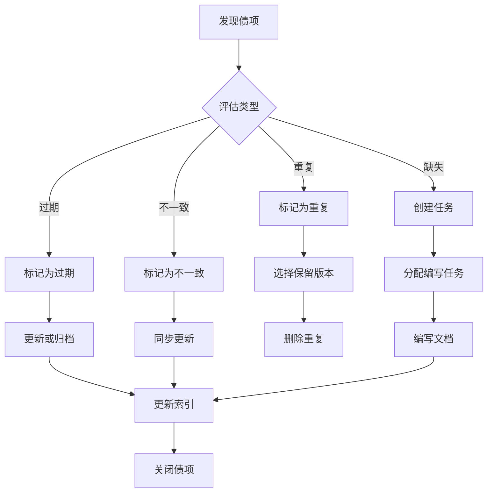

# 文档治理委员会

## 元信息
- **文档类型**: 组织规范
- **版本**: V1.0
- **创建日期**: 2026-04-12
- **最后更新**: 2026-04-12
- **状态**: 已发布
- **上级组织**: 工作组治理委员会

---

## 一、组织目标

文档治理委员会负责建立和维护项目文档体系的健康度，确保文档的：
- **准确性** - 文档内容与代码实现保持一致
- **完整性** - 覆盖所有关键业务和架构决策
- **时效性** - 及时更新，避免过期信息
- **可发现性** - 结构清晰，易于查找

---

## 二、职责范围

### 2.1 核心职责

| 职责 | 说明 | 频率 |
|:---|:---|:---|
| 文档健康度监控 | 定期检查文档质量指标 | 每周 |
| 文档债管理 | 识别、跟踪、清理文档债 | 持续 |
| 一致性检查 | 确保文档与代码一致 | 每次迭代 |
| 规范制定 | 制定和维护文档规范 | 按需 |
| 知识库维护 | 维护知识库索引和分类 | 持续 |

### 2.2 治理范围

```
┌─────────────────────────────────────────────────────────┐
│                    文档治理范围                          │
├─────────────────────────────────────────────────────────┤
│  docs/current/                                          │
│  ├── 01-product/          ← 产品需求文档                │
│  ├── 02-architecture/     ← 架构设计文档 ★重点          │
│  ├── 03-frontend/         ← 前端文档                    │
│  ├── 04-backend/          ← 后端文档                    │
│  ├── 05-process/          ← 业务流程文档                │
│  ├── 06-testing/          ← 测试文档                    │
│  ├── 07-operations/       ← 运维文档                    │
│  ├── 08-tasks/            ← 任务文档                    │
│  ├── 09-references/       ← 参考资料                    │
│  ├── 10-project/          ← 项目管理文档                │
│  ├── 11-knowledge/        ← 知识库 ★重点               │
│  └── 12-workgroups/       ← 工作组文档                  │
├─────────────────────────────────────────────────────────┤
│  docs/archive/            ← 归档文档（只读）            │
└─────────────────────────────────────────────────────────┘
```

---

## 三、工作机制

### 3.1 定期会议

| 会议类型 | 频率 | 参与者 | 内容 |
|:---|:---|:---|:---|
| 文档健康度评审 | 每周五 | 委员会成员 | 审查健康度报告 |
| 文档债清理计划 | 每两周 | 全体成员 | 规划清理工作 |
| 规范修订评审 | 按需 | 相关成员 | 评审规范变更 |

### 3.2 工作流程

```
发现问题 → 记录债项 → 评估优先级 → 分配任务 → 执行清理 → 验证关闭
    ↑                                                    │
    └──────────────── 监控反馈 ──────────────────────────┘
```

---

## 四、文档健康度指标

### 4.1 核心指标 (KPI)

| 指标 | 目标值 | 说明 |
|:---|:---:|:---|
| 文档覆盖率 | ≥ 90% | 核心功能必须有文档 |
| 文档新鲜度 | ≥ 80% | 30天内更新过的文档比例 |
| 重复文档率 | ≤ 5% | 重复或相似文档占比 |
| 孤儿文档率 | ≤ 3% | 未被引用的孤立文档占比 |
| 一致性得分 | ≥ 95% | 文档与代码一致的比例 |

### 4.2 健康度等级

| 等级 | 得分范围 | 状态 | 行动 |
|:---|:---:|:---|:---|
| 🟢 健康 | 90-100 | 正常 | 维持现状 |
| 🟡 警告 | 70-89 | 需关注 | 制定改进计划 |
| 🔴 危险 | < 70 | 需立即处理 | 启动紧急治理 |

---

## 五、文档债分类与处理

### 5.1 债项分类

| 类型 | 优先级 | 处理时限 | 示例 |
|:---|:---:|:---:|:---|
| 重复文档 | P1 | 3天 | 同一文档多处存在 |
| 过期文档 | P1 | 7天 | 内容已过时 |
| 不一致文档 | P1 | 7天 | 与代码实现不符 |
| 缺失文档 | P2 | 14天 | 关键功能无文档 |
| 结构混乱 | P2 | 14天 | 目录结构不合理 |
| 格式不规范 | P3 | 30天 | 不符合模板要求 |

### 5.2 处理流程



---

## 六、工具与自动化

### 6.1 检查工具

| 工具 | 用途 | 位置 |
|:---|:---|:---|
| 文档健康度检查脚本 | 自动检查文档指标 | `tools/doc-health-check.js` |
| 重复文档检测 | 查找相似文档 | `tools/doc-duplicate-finder.js` |
| 一致性检查器 | 对比文档与代码 | `tools/doc-code-sync-checker.js` |
| 索引更新工具 | 自动更新README索引 | `tools/doc-index-updater.js` |

### 6.2 自动化流程

```yaml
# 文档健康度检查工作流
name: Document Health Check
on:
  schedule:
    - cron: '0 9 * * 1'  # 每周一早9点
triggers:
  - push:
      paths:
        - 'docs/**'

jobs:
  health-check:
    steps:
      - run: node tools/doc-health-check.js
      - run: node tools/doc-duplicate-finder.js
      - run: node tools/doc-code-sync-checker.js
```

---

## 七、文档清单

| 序号 | 文档 | 说明 | 状态 |
|:---:|:---|:---|:---:|
| 01 | [文档健康度检查机制](./01-方案与规范/文档健康度检查机制.md) | 健康度检查规范 | ✅ 已发布 |
| 02 | [文档一致性检查清单](./01-方案与规范/文档一致性检查清单.md) | 代码文档对比检查 | ✅ 已发布 |
| 03 | [文档健康度检查清单](./01-方案与规范/文档健康度检查清单.md) | 文档遍历检查项 | ✅ 已发布 |
| 04 | [文档债跟踪清单](./03-跟踪与报告/文档债跟踪清单.md) | 当前文档债列表 | ✅ 持续更新 |

---

## 八、快速链接

- [文档管理规范](../../09-references/文档管理规范.md)
- [文档重组方案](../../09-references/文档重组方案.md)
- [代码文档对比检查指南](../../09-references/代码文档对比检查指南.md)
- [知识库索引](../../11-knowledge/meta/index.json)

---

## 变更记录

| 日期 | 版本 | 变更内容 | 作者 |
|:---|:---:|:---|:---|
| 2026-04-12 | V1.0 | 初始版本 | 文档治理委员会 |

---

**委员会负责人**: 待指定  
**下次评审日期**: 2026-04-19
