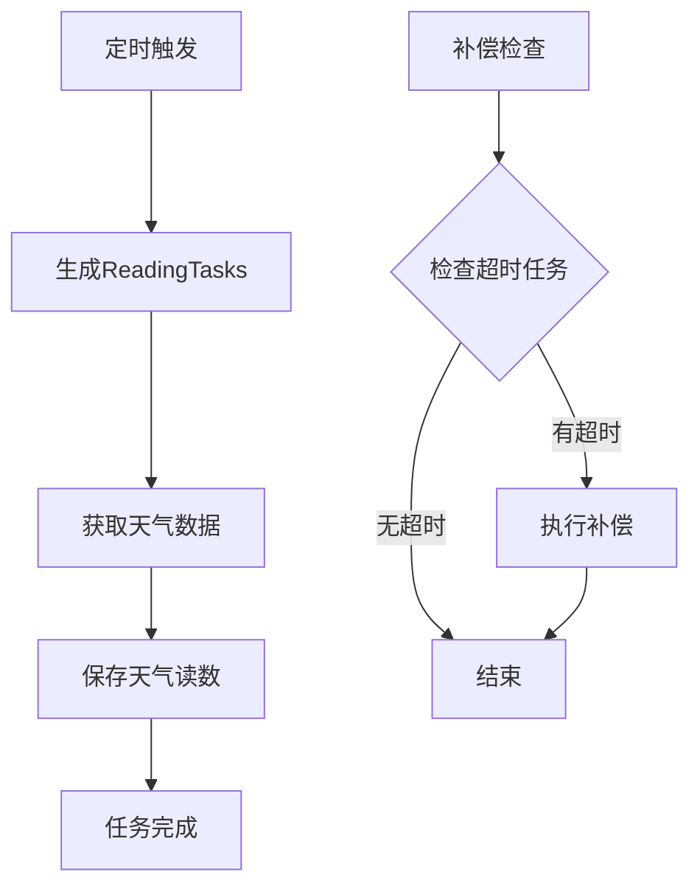

# 软件设计心得

> 演讲时长：2-3分钟
> 目标受众：计算机/软件专业同学
> 核心信息：AI时代的软件设计思想、DDD实践、架构决策

---

## 开场（20秒）

> "前面分享了AI怎么帮我写代码，以及我踩过的坑。
> 现在想聊聊更深层的思考：
> AI时代，程序员的核心竞争力到底是什么？
> 我的答案是：设计能力。"

---

## 一、AI时代的设计能力（40秒）

### 代码实现 vs 架构设计

| 能力类型 | AI的表现 | 人的价值 |
|:---|:---|:---|
| **代码实现** | 优秀 | 验证、Review、调优 |
| **架构设计** | 辅助 | 主导、决策、把控 |
| **需求理解** | 弱 | 核心能力 |
| **业务建模** | 弱 | 核心能力 |

### 核心观点

> "AI可以帮你写代码，但不能替你思考。
> 好的架构让AI生成的代码有地方放，
> 坏的架构让AI越帮越乱。"

### 设计能力的三层

```
┌─────────────────────────────────────┐
│  第一层：需求理解                     │
│  用户真正需要什么？                   │
├─────────────────────────────────────┤
│  第二层：业务建模                     │
│  领域概念、关系、边界                 │
├─────────────────────────────────────┤
│  第三层：技术实现                     │
│  架构选型、技术栈、部署               │
└─────────────────────────────────────┘
```

---

## 二、领域驱动设计（DDD）实践（1分钟）⭐核心

### 为什么选择DDD

> "AI擅长写代码，但AI不懂你的业务。
> DDD强迫你用业务语言描述系统，
> 这样AI生成的代码更符合业务逻辑。"

### 我们的领域划分

```
智能园艺助手
├── 用户域（User Domain）
│   ├── 用户注册、登录
│   └── 用户信息管理
│
├── 植物域（Plant Domain）
│   ├── 植物档案管理
│   ├── 养护记录
│   └── 诊断历史
│
├── 设备域（Device Domain）
│   ├── 设备绑定/解绑
│   └── 环境数据采集
│
└── AI域（AI Domain）
    ├── 会话管理
    └── AI调用与解析
```

### 领域边界的好处

**1. 代码组织清晰**

```
src/
├── controllers/
│   ├── users/          # 用户域
│   ├── plants/         # 植物域
│   ├── devices/        # 设备域
│   └── sessions/       # AI域
├── services/
│   ├── UserService.js
│   ├── PlantService.js
│   ├── DeviceService.js
│   └── SessionService.js
└── models/
    ├── User.js
    ├── Plant.js
    ├── Device.js
    └── Session.js
```

**2. AI更容易理解上下文**

**❌ 模糊的Prompt**
```
帮我写一个功能，处理植物和设备的关系
```

**✅ 基于DDD的Prompt**
```
在设备域（Device Domain）中，
实现设备绑定到植物的功能。

业务规则：
1. 一个设备同一时间只能绑定一个植物
2. 解绑后设备可以重新绑定
3. 绑定需要验证设备所有权

参考植物域的PlantService实现风格。
```

**3. 便于团队协作**

> "即使我一个人开发，'协作'也是和AI协作。
> 清晰的领域边界让AI更容易理解上下文，
> 生成的代码更符合预期。"

---

## 三、架构决策记录（40秒）

### 重要决策1：为什么选择微信小程序？

| 选项 | 优势 | 劣势 | 决策 |
|:---|:---|:---|:---:|
| 微信小程序 | 无需下载、生态丰富 | 平台绑定 | ✅ |
| React Native | 跨平台 | 包体积大 | ❌ |
| Flutter | 性能好 | 学习成本 | ❌ |
| Web App | 最灵活 | 体验差 | ❌ |

**决策理由**：
> "MVP阶段，用户获取成本比技术完美更重要。
> 微信小程序的'即用即走'特性，
> 最适合验证植物养护这个场景。"

### 重要决策2：为什么选择Node.js？

| 选项 | 优势 | 劣势 | 决策 |
|:---|:---|:---|:---:|
| Node.js | 全栈JS、开发快 | 性能一般 | ✅ |
| Python | AI生态好 | 前后端语言不一致 | ❌ |
| Java | 企业级 | 开发慢 | ❌ |
| Go | 性能好 | 生态不如Node | ❌ |

**决策理由**：
> "全栈JavaScript，一个人可以搞定前后端。
> 对于I/O密集型的Web服务，Node.js性能足够。
> 开发效率优先。"

### 重要决策3：分层架构设计

```
┌─────────────────────────────────────┐
│  Controller层                        │
│  职责：参数校验、认证、响应格式化      │
├─────────────────────────────────────┤
│  Service层                           │
│  职责：业务逻辑、事务、跨领域协调      │
├─────────────────────────────────────┤
│  Model层                             │
│  职责：数据访问、关联定义             │
└─────────────────────────────────────┘
```

**决策理由**：
> "前期Controller臃肿的教训让我明白：
> 分层不是过度设计，是为了让AI有章可循。
> 告诉AI'这是Service层'，它就知道该写什么类型的代码。"

---

## 四、文档即设计（30秒）

### Mermaid图的价值

> "我用Mermaid画架构图，不只是为了给别人看，
> 更是为了给AI看。
> 把架构图贴给AI，它生成的代码更符合架构设计。"

### 示例：环境数据补偿机制

**Mermaid流程图**（给AI看）：


**Prompt**：
```
基于上面的流程图，实现环境数据补偿机制。
要求：
1. 使用Node.js + node-cron实现定时任务
2. 补偿逻辑放在compensationService.js
3. 需要单元测试覆盖主流程和边界情况
```

**AI生成结果**：
- 代码结构与流程图一致
- 命名与图中节点对应
- 逻辑分支完整

---

## 五、测试驱动与AI（20秒）

### TDD + AI的工作流

```
我写测试用例 → AI生成实现 → 我Review → 迭代优化
```

**优势**：
1. **约束AI**：测试用例是明确的契约，AI生成的代码必须满足
2. **提高质量**：AI生成的代码有测试保障，bug更少
3. **节省时间**：70%的测试代码由AI生成，我只补充边界情况

### 数据

> "这个项目有640+测试用例，代码覆盖率60%。
> 其中70%的测试骨架是AI生成的。"

---

## 六、总结（20秒）

### AI时代的程序员核心竞争力

```
┌─────────────────────────────────────┐
│  高价值（人主导）                     │
│  • 需求理解与分析                     │
│  • 业务建模与领域设计                 │
│  • 架构决策与技术选型                 │
│  • 代码Review与质量把控               │
├─────────────────────────────────────┤
│  中价值（人+AI协作）                  │
│  • 详细设计                           │
│  • 测试用例设计                       │
│  • 文档编写                           │
├─────────────────────────────────────┤
│  低价值（AI主导）                     │
│  • 代码实现                           │
│  • 重复性工作                         │
│  • 样板代码                           │
└─────────────────────────────────────┘
```

### 一句话总结

> "AI时代，从'写代码的人'变成'设计系统的人'。
> 代码实现交给AI，你把控方向和质量。
> 这才是程序员的价值升华。"

---

## 演示配合材料

### 需要展示的文件

1. `docs/02-architecture/系统架构设计.md` - 架构图
2. `docs/11-knowledge/ai-memory/decisions/` - 架构决策记录
3. `backend/server/src/services/` - Service层实现
4. `backend/server/tests/` - 测试用例

### 可以展示的数据

- 领域划分图
- 分层架构图
- 测试覆盖率报告

---

## 关联文档

- [Vibe-Coding心得](./03-Vibe-Coding心得.md) - AI协作的具体方法
- [教训总结案例](./04-教训总结案例.md) - 设计失误的教训
- [架构讲解脚本](./02-架构讲解脚本.md) - 架构详细介绍
