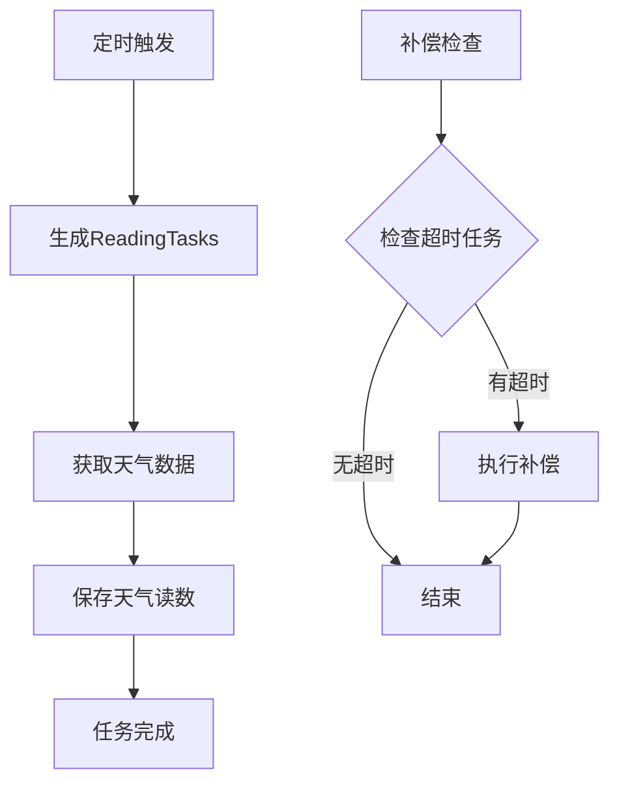

# 软件设计心得

> 演讲时长：2-3分钟
> 目标受众：计算机/软件专业同学
> 核心信息：AI时代的分层架构思想、实用架构决策

---

## 开场（20秒）

> "前面分享了AI怎么帮我写代码，以及我踩过的坑。
> 现在想聊聊更深层的思考：
> AI时代，程序员的核心竞争力到底是什么？
> 我的答案是：设计能力。"

---

## 一、AI时代的设计能力（40秒）

### 代码实现 vs 架构设计

| 能力类型 | AI的表现 | 人的价值 |
|:---|:---|:---|
| **代码实现** | 优秀 | 验证、Review、调优 |
| **架构设计** | 辅助 | 主导、决策、把控 |
| **需求理解** | 弱 | 核心能力 |
| **业务建模** | 弱 | 核心能力 |

### 核心观点

> "AI可以帮你写代码，但不能替你思考。
> 好的架构让AI生成的代码有地方放，
> 坏的架构让AI越帮越乱。"

### 设计能力的三层

```
┌─────────────────────────────────────┐
│  第一层：需求理解                     │
│  用户真正需要什么？                   │
├─────────────────────────────────────┤
│  第二层：业务建模                     │
│  领域概念、关系、边界                 │
├─────────────────────────────────────┤
│  第三层：技术实现                     │
│  架构选型、技术栈、部署               │
└─────────────────────────────────────┘
```

---

## 二、分层架构设计（1分钟）⭐核心

### 为什么分层

> "项目初期我把所有逻辑都写在Controller里，
> 一个方法150行，没法测试，改一处坏一片。
> 后来分了层，代码才清晰起来。"

### 三层架构

```
┌─────────────────────────────────────┐
│  Controller层                        │
│  职责：参数校验、认证、响应格式化      │
├─────────────────────────────────────┤
│  Service层                           │
│  职责：业务逻辑、事务、跨模块协调      │
├─────────────────────────────────────┤
│  Model层                             │
│  职责：数据访问、关联定义             │
└─────────────────────────────────────┘
```

### 实际项目结构

```
src/
├── controllers/    # 11个控制器
├── services/       # 12个服务
├── models/         # 15个模型
└── middleware/     # 7个中间件
```

### 这样做的好处

**1. 职责清晰**
- Controller只管接收请求和返回响应
- 业务逻辑都在Service里

**2. 便于AI生成代码**
- 告诉AI"这是Service层"，它就知道该写什么类型的代码
- 有规范，AI生成的代码风格一致

**3. 便于测试**
- Service层不依赖HTTP，可以直接写单元测试

---

## 三、架构决策记录（40秒）

### 决策1：微信小程序

| 选项 | 优势 | 劣势 | 决策 |
|:---|:---|:---|:---|
| 微信小程序 | 无需下载、生态丰富 | 平台绑定 | ✅ |
| React Native | 跨平台 | 包体积大 | ❌ |
| Flutter | 性能好 | 学习成本 | ❌ |

**理由**：MVP阶段，用户获取成本比技术完美更重要。

### 决策2：Node.js

| 选项 | 优势 | 劣势 | 决策 |
|:---|:---|:---|:---|
| Node.js | 全栈JS、开发快 | 性能一般 | ✅ |
| Python | AI生态好 | 前后端语言不一致 | ❌ |

**理由**：全栈JavaScript，一个人搞定前后端，开发效率优先。

### 决策3：分层架构

> "分层不是过度设计，是为了让代码有章可循。
> 告诉AI'这是Service层'，它就知道该写什么类型的代码。"

---

## 四、文档即设计（30秒）

### Mermaid图的价值

> "我用Mermaid画架构图，不只是为了给别人看，
> 更是为了给AI看。
> 把架构图贴给AI，它生成的代码更符合架构设计。"

### 示例：环境数据补偿机制

**Mermaid流程图**（给AI看）：


**Prompt**：
```
基于上面的流程图，实现环境数据补偿机制。
要求：
1. 使用Node.js + node-cron实现定时任务
2. 补偿逻辑放在compensationService.js
3. 需要单元测试覆盖主流程和边界情况
```

---

## 五、总结（20秒）

### 一句话

> "AI时代，从'写代码的人'变成'设计系统的人'。
> 代码实现交给AI，你把控方向和质量。
> 分层架构让代码有章可循，这是AI辅助开发的基础。"

---

## 演示配合材料

### 需要展示的文件

1. `backend/server/src/app.js` - 看分层和模块注册
2. `backend/server/src/services/SessionService.js` - 看Service层代码
3. `docs/02-architecture/系统架构设计.md` - 看架构图

---

## 关联文档

- [Vibe-Coding心得](./03-Vibe-Coding心得.md) - AI协作的具体方法
- [教训总结案例](./04-教训总结案例.md) - 踩过的坑
- [架构讲解脚本](./02-架构讲解脚本.md) - 架构详细介绍
