# Mermaid 图表集合

> 演示时直接展示这些图表

---

## 1. 系统架构图（整体）

```mermaid
flowchart TB
    subgraph Client["客户端"]
        MP["微信小程序"]
        DeviceHW["IoT设备"]
    end

    subgraph Middleware["中间件"]
        Auth["auth.js<br/>JWT认证"]
        DeviceAuth["deviceAuth.js<br/>设备认证"]
        LogAuth["logAuth.js<br/>日志访问认证"]
        ErrorHandler["errorHandler.js<br/>错误处理"]
        Validator["validator.js<br/>参数校验"]
        Response["response.js<br/>响应格式化"]
    end

    subgraph Controllers["控制器层"]
        UserCtrl["userController"]
        PlantCtrl["plantController"]
        SessionCtrl["sessionController"]
        DeviceCtrl["deviceController"]
        EnvCtrl["environmentController"]
        AICtrl["aiController"]
        CareCtrl["careRecordController"]
        DiagCtrl["diagnosisController"]
        LogCtrl["logController"]
        COSCtrl["cosController"]
        WeatherCtrl["weatherController"]
        StorageCtrl["storageController"]
    end

    subgraph Services["服务层"]
        UserService["UserService"]
        PlantService["PlantService"]
        SessionService["SessionService"]
        DeviceService["DeviceService"]
        EnvService["EnvironmentService"]
        AIService["aiService"]
        AsyncAIService["asyncAiService"]
        CareService["CareRecordService"]
        WechatAuth["WechatAuthService"]
        WeatherService["weatherService"]
        CompService["compensationService"]
        CacheService["CacheService"]
        BaseService["BaseService"]
    end

    subgraph Models["数据模型层"]
        User["User"]
        Plant["Plant"]
        Session["Session"]
        Message["Message"]
        Device["Device"]
        EnvReading["EnvironmentReading"]
        EnvValue["EnvironmentReadingValue"]
        DiagnosisCard["DiagnosisCard"]
        CareRecord["CareRecord"]
        UserConfig["UserConfig"]
        ReadingTask["ReadingTask"]
        SystemLog["SystemLog"]
        ClientLog["ClientLog"]
    end

    subgraph Data["数据层"]
        MySQL[("MySQL 8.0")]
        Redis[("Redis")]
    end

    subgraph External["外部服务"]
        WeChat["微信服务"]
        GLM["智谱GLM"]
        WeatherAPI["和风天气"]
        COS["腾讯云COS"]
    end

    %% 客户端请求
    MP -->|用户请求| Auth
    DeviceHW -->|设备数据| DeviceAuth
    
    %% 中间件到控制器
    Auth --> UserCtrl
    Auth --> PlantCtrl
    Auth --> SessionCtrl
    Auth --> AICtrl
    Auth --> CareCtrl
    Auth --> DiagCtrl
    Auth --> COSCtrl
    Auth --> WeatherCtrl
    Auth --> LogCtrl
    DeviceAuth --> DeviceCtrl
    DeviceAuth --> EnvCtrl
    LogAuth --> LogCtrl
    
    %% 控制器到服务
    UserCtrl --> UserService
    PlantCtrl --> PlantService
    SessionCtrl --> SessionService
    DeviceCtrl --> DeviceService
    EnvCtrl --> EnvService
    AICtrl --> AIService
    AICtrl --> AsyncAIService
    CareCtrl --> CareService
    DiagCtrl --> SessionService
    LogCtrl --> BaseService
    COSCtrl --> BaseService
    WeatherCtrl --> WeatherService
    StorageCtrl --> BaseService
    
    %% 服务间调用
    UserService --> WechatAuth
    UserService --> CacheService
    SessionService --> AIService
    SessionService --> PlantService
    SessionService --> EnvService
    DeviceService --> WeatherService
    DeviceService --> PlantService
    EnvService --> CompService
    AIService --> SessionService
    
    %% 服务到模型
    UserService --> User
    UserService --> UserConfig
    PlantService --> Plant
    SessionService --> Session
    SessionService --> Message
    DeviceService --> Device
    EnvService --> EnvReading
    EnvService --> EnvValue
    EnvService --> ReadingTask
    AIService --> DiagnosisCard
    CareService --> CareRecord
    LogCtrl --> SystemLog
    LogCtrl --> ClientLog
    
    %% 模型到数据库
    User --> MySQL
    Plant --> MySQL
    Session --> MySQL
    Message --> MySQL
    Device --> MySQL
    EnvReading --> MySQL
    DiagnosisCard --> MySQL
    CareRecord --> MySQL
    UserConfig --> MySQL
    ReadingTask --> MySQL
    SystemLog --> MySQL
    ClientLog --> MySQL
    
    %% 缓存
    CacheService --> Redis
    UserService --> Redis
    
    %% 外部服务
    WechatAuth --> WeChat
    AIService --> GLM
    AsyncAIService --> GLM
    WeatherService --> WeatherAPI
    COSCtrl --> COS
    
    %% 继承关系
    BaseService -.->|继承| UserService
    BaseService -.->|继承| PlantService
    BaseService -.->|继承| SessionService
    BaseService -.->|继承| DeviceService
    BaseService -.->|继承| EnvService
    BaseService -.->|继承| CareService
```

---

## 2. 后端分层架构图（详细）

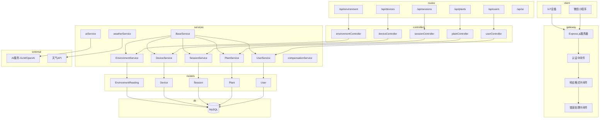

---

## 3. 数据库ER图

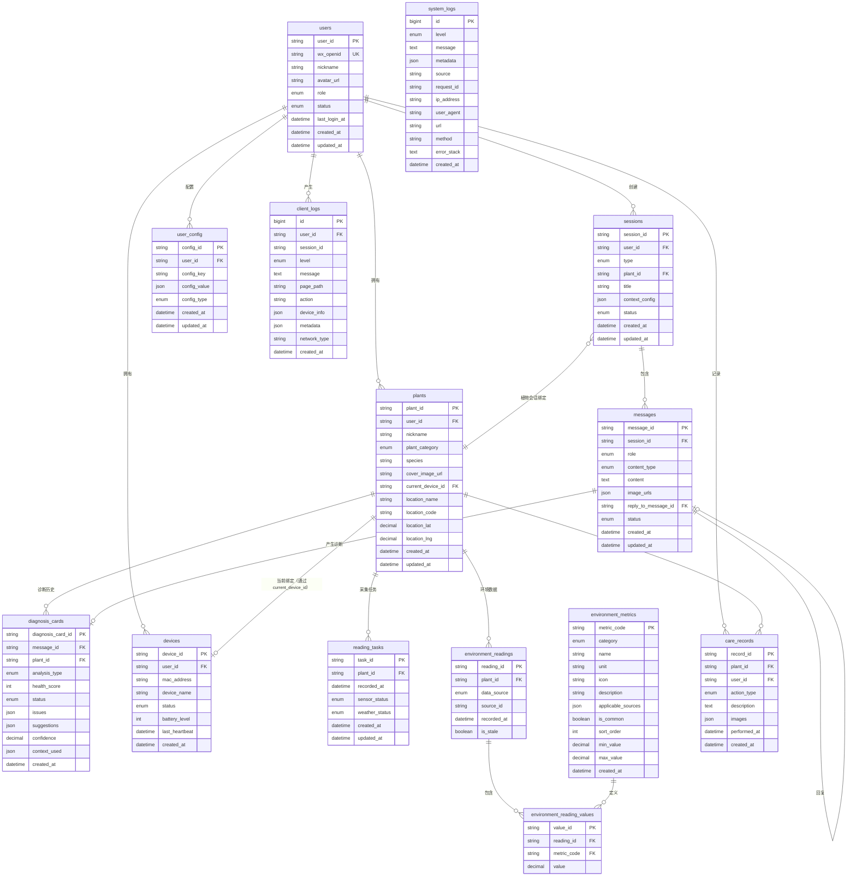

---

## 4. 分层架构图（简化）

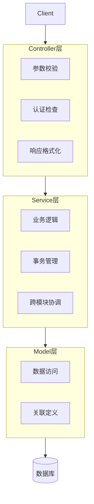

---

## 5. 环境数据补偿流程

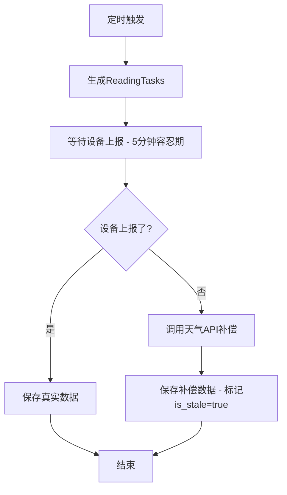

---

## 6. 双轨会话设计

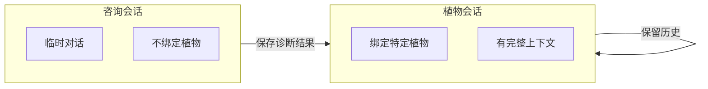

---

## 7. 环境数据采集时序图

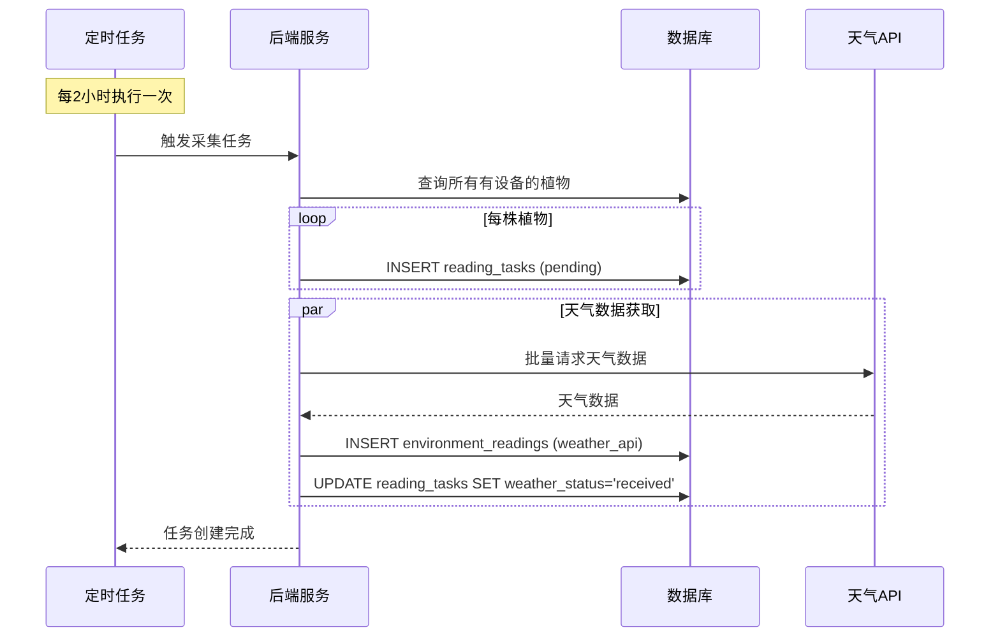

---

## 8. 传感器数据上报时序图

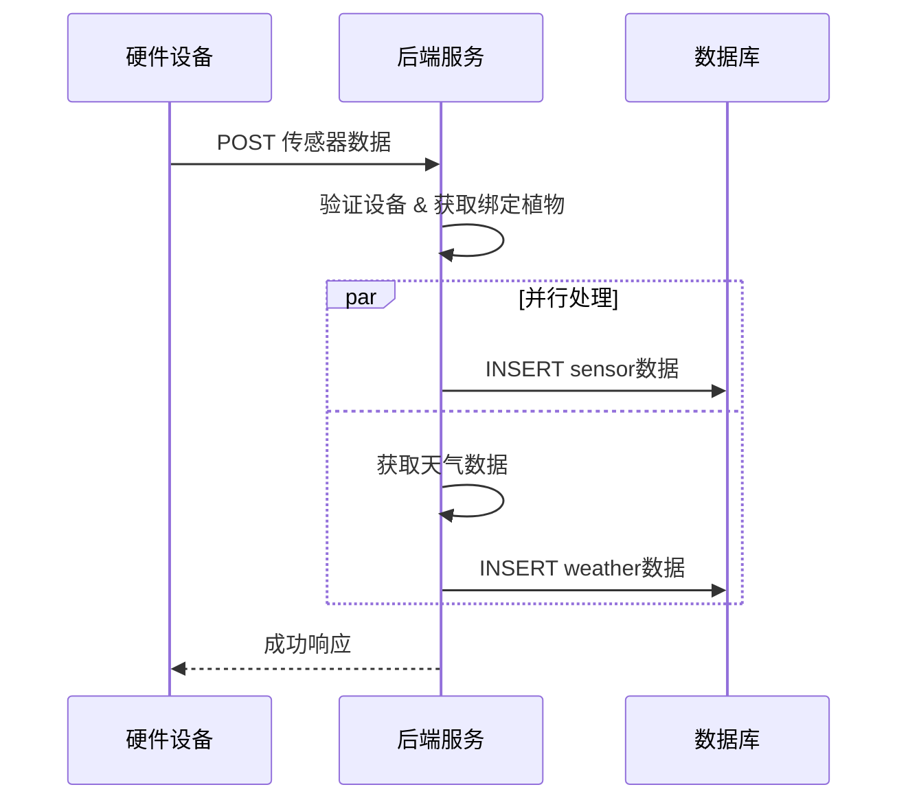

---

## 9. AI诊断流程

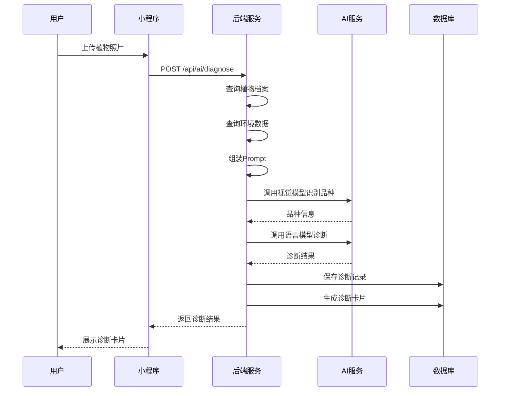

---

## 10. CI/CD流水线

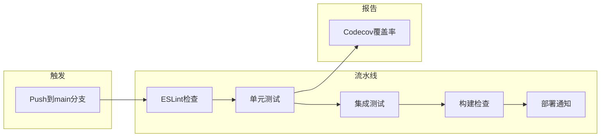

---

## 11. 中间件处理流程

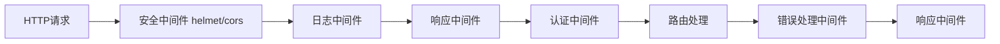

---

## 12. 用户登录认证流程

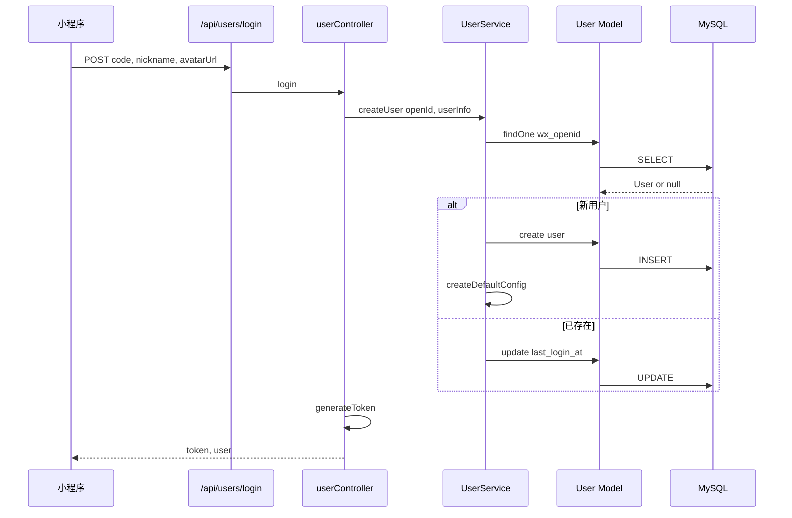

---

## 13. 会话消息处理流程

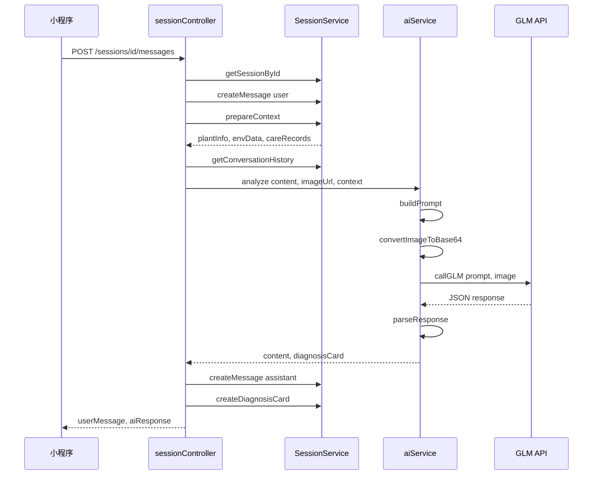

---

## 14. 环境数据系统架构

```mermaid
graph TB
    subgraph 数据来源
        IOT[IoT设备传感器]
        WEATHER[天气API]
        USER[用户手动录入]
    end

    subgraph 数据采集层
        DEVICE_API[/api/devices/data -- 设备认证/]
        ENV_API[/api/environment/readings -- 统一入口/]
    end

    subgraph 数据处理层
        DS[DeviceService]
        ES[EnvironmentService]
        WS[weatherService]
        CS[compensationService]
    end

    subgraph 数据存储层
        ER[(EnvironmentReading)]
        ERV[(EnvironmentReadingValue)]
        EM[(EnvironmentMetric)]
        RT[(ReadingTask)]
    end

    subgraph 数据查询层
        ENV_QUERY[/api/environment/current]
        HIST_QUERY[/api/environment/history]
    end

    subgraph 消费端
        MP[微信小程序]
        JOB[定时任务补偿]
    end

    IOT --> DEVICE_API
    WEATHER --> WS
    USER --> ENV_API
    
    DEVICE_API --> DS
    ENV_API --> ES
    
    DS --> ES
    DS --> WS
    WS --> ER
    ES --> CS
    
    ES --> ER
    ER --> ERV
    EM --> ERV
    ES --> RT
    
    MP --> ENV_QUERY
    MP --> HIST_QUERY
    ENV_QUERY --> ES
    HIST_QUERY --> ES
    
    JOB --> CS
    CS --> ER
```

---

## 15. 虚拟设备数据流（GitHub二次开发）

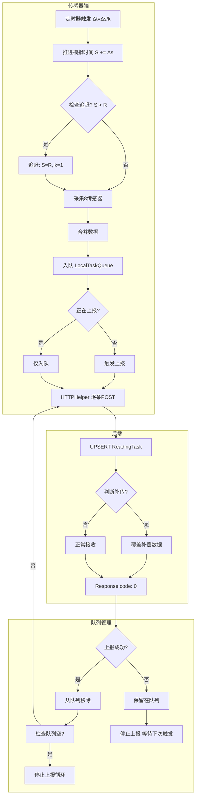

---

## 16. 核心模块依赖关系

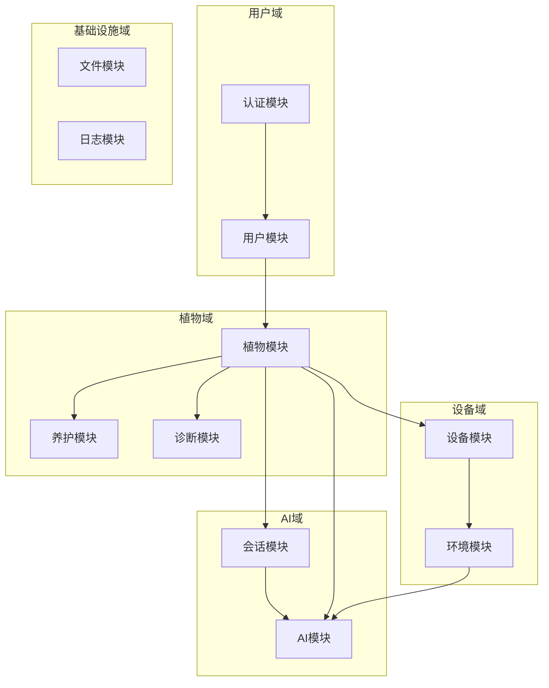

---

## 17. ReadingTask状态流转

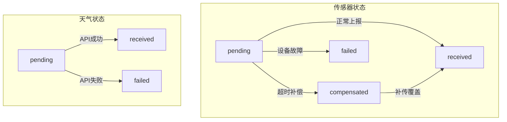

---

## 18. 异步AI分析流程

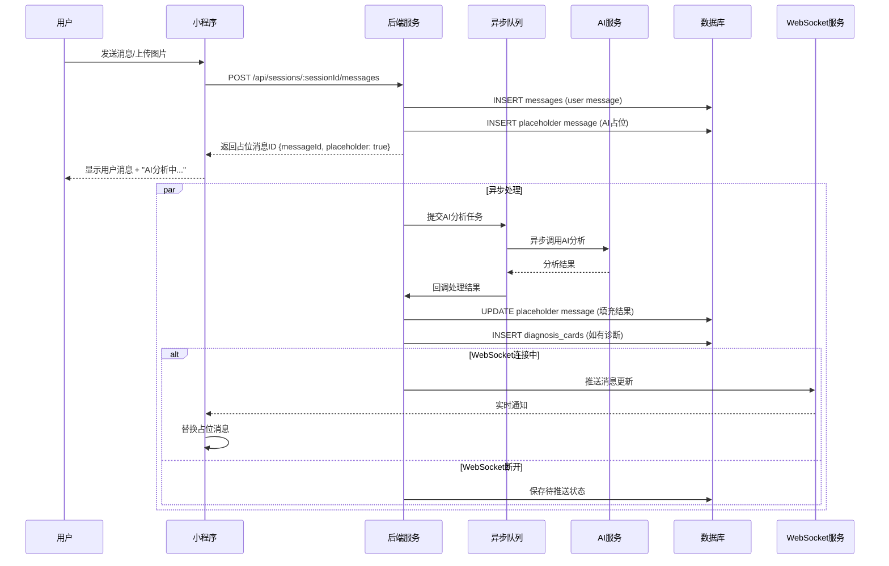

---

## 使用说明

1. 打开本文档，找到需要展示的图表
2. 确保浏览器或VS Code安装了Mermaid插件
3. 演示时直接滚动到对应图表

---

## 演示顺序建议

| 顺序 | 图表 | 用途 | 必讲 |
|:---:|:---|:---:|:---:|
| 1 | 系统架构图（整体） | 讲技术架构 | ✅ |
| 2 | 后端分层架构图（详细） | 讲分层设计 | ✅ |
| 3 | 分层架构图（简化） | 快速说明三层 | ✅ |
| 4 | 核心模块依赖关系 | 讲模块划分 | ✅ |
| 5 | 环境数据补偿流程 | 讲数据补偿亮点 | 可选 |
| 6 | 虚拟设备数据流 | 讲GitHub二次开发 | 可选 |
| 7 | CI/CD流水线 | 顺嘴提自动化 | 可选 |
| 8 | 数据库ER图 | 时间充裕时展示 | 可选 |
| 9-18 | 其他时序图 | 被问到时展示 | 备用 |
