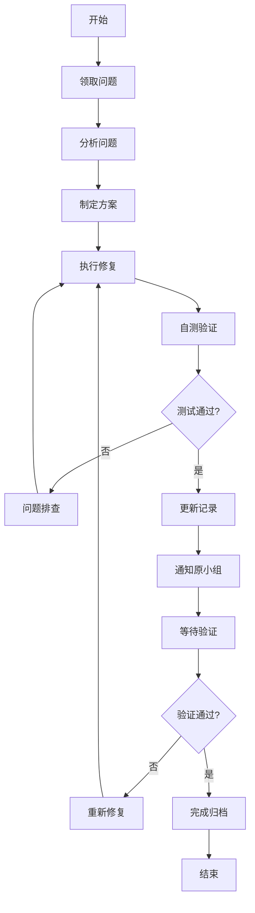

# 修复工作流程

## 元信息
- **文档类型**: 工作流程
- **版本**: V1.0
- **创建日期**: 2026-04-11
- **适用范围**: 问题修复工作组

---

## 一、工作流概览



---

## 二、详细流程

### 阶段1: 领取问题

#### 2.1.1 选择问题
1. 打开 `02-任务队列/待修复问题.md`
2. 按优先级选择问题（高危 → 中危 → 低危）
3. 检查问题状态为 `⏳ 待修复`

#### 2.1.2 更新状态
1. 更新问题状态为 `🔄 修复中`
2. 记录领取人和领取时间
3. 创建修复记录文件 `03-修复记录/{问题编号}.md`

#### 2.1.3 问题领取模板

```markdown
## 问题领取
- **领取人**: 
- **领取时间**: YYYY-MM-DD HH:mm
- **预计完成**: YYYY-MM-DD HH:mm
- **状态**: 🔄 修复中
```

---

### 阶段2: 分析问题

#### 2.2.1 信息收集
1. 阅读原工作小组的问题描述
2. 查看相关执行记录文件
3. 收集相关日志（如需要）

#### 2.2.2 代码定位
1. 根据文件位置定位问题代码
2. 理解代码上下文
3. 识别关联文件

#### 2.2.3 根因分析
1. 确定问题根本原因
2. 分析影响范围
3. 评估修复风险

#### 2.2.4 问题分析模板

```markdown
## 问题分析

### 问题定位
- **文件位置**: 
- **代码行号**: 
- **问题代码**:
```javascript
// 问题代码片段
```

### 根因分析
- **根本原因**: 
- **影响范围**: 
- **关联文件**: 

### 修复风险评估
- **风险等级**: 低 / 中 / 高
- **可能影响**: 
- **回滚方案**: 
```

---

### 阶段3: 制定方案

#### 2.3.1 方案设计
1. 设计修复方案
2. 考虑边界情况
3. 确保向后兼容

#### 2.3.2 方案评审（高危问题）
- 对于 🔴 高危问题，需记录修复方案
- 评估安全影响
- 确认测试覆盖

#### 2.3.3 方案模板

```markdown
## 修复方案

### 方案概述
- **修复思路**: 
- **修改内容**: 

### 代码变更
```javascript
// 修复后的代码
```

### 测试计划
- [ ] 正常场景测试
- [ ] 异常场景测试
- [ ] 边界条件测试
- [ ] 回归测试
```

---

### 阶段4: 执行修复

#### 2.4.1 代码修改
1. 按照方案修改代码
2. 遵循项目代码规范
3. 添加必要的注释

#### 2.4.2 关联检查
根据 [项目规则](../../.trae/rules/project_rules.md) 检查关联文件：

| 修改文件类型 | 必须检查 |
|:---|:---|
| `models/*.js` | `controllers/`, `services/`, 前端 API |
| `services/*.js` | `controllers/`, 相关测试 |
| `controllers/*.js` | `routes/`, 相关测试 |
| `routes/*.js` | `frontend/utils/api.js` |
| `middleware/*.js` | `app.js`, 相关路由 |

#### 2.4.3 代码审查
- 自查代码质量
- 检查命名规范
- 验证错误处理

---

### 阶段5: 自测验证

#### 2.5.1 功能验证
1. 验证修复是否解决问题
2. 测试正常流程
3. 测试异常流程

#### 2.5.2 回归测试
1. 测试相关功能
2. 确保无新引入问题
3. 验证边界条件

#### 2.5.3 安全检查（安全类问题）
1. 验证安全漏洞已修复
2. 检查无新安全风险
3. 确认权限控制正确

#### 2.5.4 自测记录模板

```markdown
## 自测验证

### 测试环境
- **分支**: 
- **Node版本**: 
- **数据库**: 

### 功能测试
| 测试项 | 预期结果 | 实际结果 | 状态 |
|:---|:---|:---|:---:|
| 正常场景 | | | ✅ |
| 异常场景 | | | ✅ |
| 边界条件 | | | ✅ |

### 回归测试
- [ ] 相关功能正常
- [ ] 无新引入问题

### 安全检查（如适用）
- [ ] 安全漏洞已修复
- [ ] 权限控制正确
```

---

### 阶段6: 更新记录

#### 2.6.1 更新修复记录
1. 完善修复记录文件
2. 记录修复详情
3. 添加测试证据

#### 2.6.2 更新问题清单
1. 更新 `02-任务队列/待修复问题.md`
2. 更新状态为 `✅ 已修复`
3. 记录修复时间和修复人

---

### 阶段7: 通知原小组

#### 2.7.1 创建通知
1. 创建协作通知文件
2. 说明修复内容
3. 提供验证指引

#### 2.7.2 通知模板

```markdown
## 修复完成通知: {问题编号}

### 修复概要
- **问题编号**: {OM/SA}-X-XXX
- **修复时间**: YYYY-MM-DD HH:mm
- **修复人**: 

### 修复内容
- **修改文件**: 
- **修复说明**: 

### 验证指引
1. 拉取最新代码
2. 执行测试: 
3. 验证要点: 

### 相关记录
- [修复记录](../03-修复记录/{问题编号}.md)
```

---

### 阶段8: 等待验证

#### 2.8.1 原小组验证
1. 运维监控小组验证 OM-xxx 问题
2. 静态分析小组验证 SA-xxx 问题

#### 2.8.2 验证结果处理
- **通过**: 更新状态为 `✔️ 已验证`，归档记录
- **不通过**: 更新状态为 `🔄 修复中`，重新修复

---

### 阶段9: 完成归档

#### 2.9.1 归档操作
1. 移动修复记录到归档目录（如需要）
2. 更新统计信息
3. 总结经验教训

---

## 三、问题优先级处理规则

### 3.1 优先级定义

| 优先级 | 响应时间 | 修复时限 | 处理要求 |
|:---|:---:|:---:|:---|
| 🔴 高危 | 立即 | 24小时内 | 立即处理，暂停其他工作 |
| 🟠 中危 | 2小时内 | 3天内 | 优先处理，按计划执行 |
| 🟡 低危 | 4小时内 | 1周内 | 计划处理，方便时执行 |

### 3.2 并发处理规则

- 可同时处理多个 **低危** 问题
- **中危** 问题最多同时处理 2 个
- **高危** 问题必须逐个处理，完成后才能开始下一个

---

## 四、特殊情况处理

### 4.1 问题无法复现

1. 记录尝试复现的步骤
2. 联系原工作小组获取更多信息
3. 如确认已不存在，标记为 `⏸️ 已忽略`
4. 说明忽略原因

### 4.2 修复影响范围过大

1. 暂停修复
2. 评估影响范围
3. 制定分阶段修复计划
4. 升级通知项目负责人

### 4.3 需要其他小组协助

1. 记录需要的协助内容
2. 创建协作请求
3. 等待协助完成后继续

---

## 五、工具与资源

### 5.1 推荐工具

| 工具 | 用途 | 使用场景 |
|:---|:---|:---|
| MCP MySQL | 数据库查询 | 需要日志分析时 |
| Git | 版本控制 | 代码修改 |
| Jest | 单元测试 | 测试验证 |

### 5.2 参考文档

- [项目规则](../../.trae/rules/project_rules.md)
- [运维监控方案](../../运维监控工作小组/01-方案与规范/运维监控方案.md)
- [静态分析方案](../../静态分析工作小组/01-方案与规范/静态分析方案.md)

---

## 六、质量检查清单

### 修复前检查
- [ ] 已理解问题根因
- [ ] 已制定修复方案
- [ ] 已评估影响范围
- [ ] 已确认关联文件

### 修复中检查
- [ ] 遵循代码规范
- [ ] 添加必要注释
- [ ] 处理边界情况
- [ ] 检查错误处理

### 修复后检查
- [ ] 功能测试通过
- [ ] 回归测试通过
- [ ] 安全检查通过（如适用）
- [ ] 记录已更新
- [ ] 原小组已通知

---

**创建时间**: 2026-04-11  
**最后更新**: 2026-04-11
