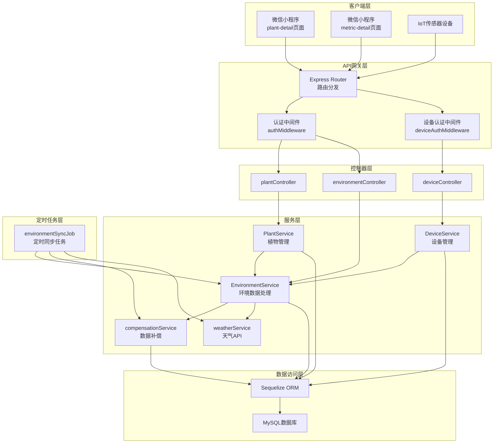
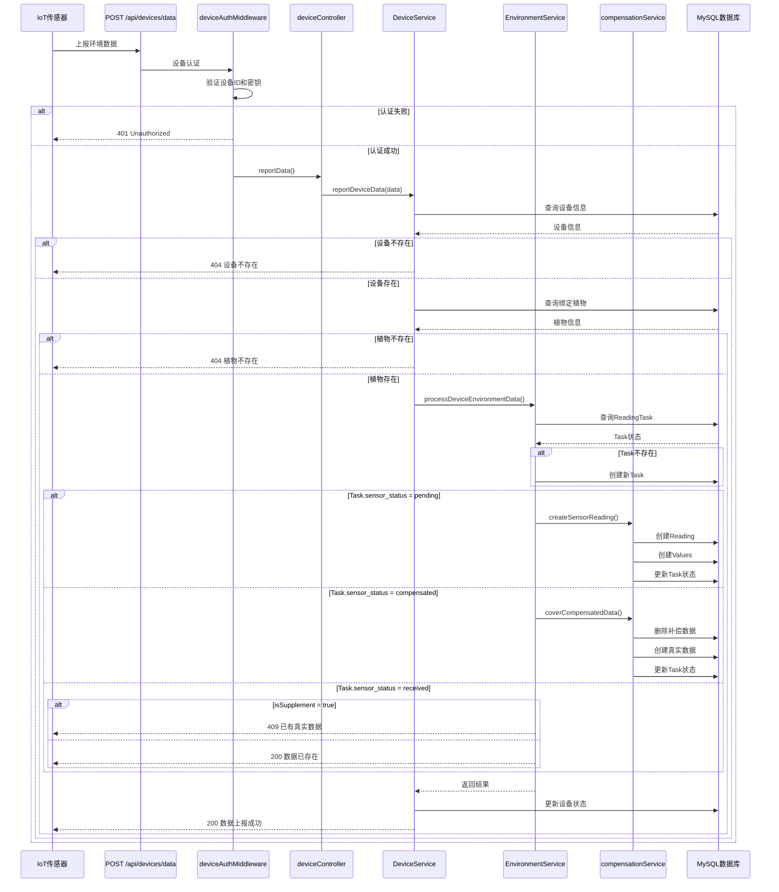
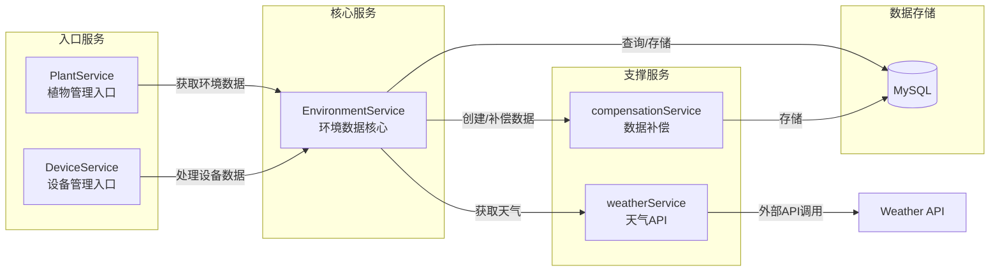
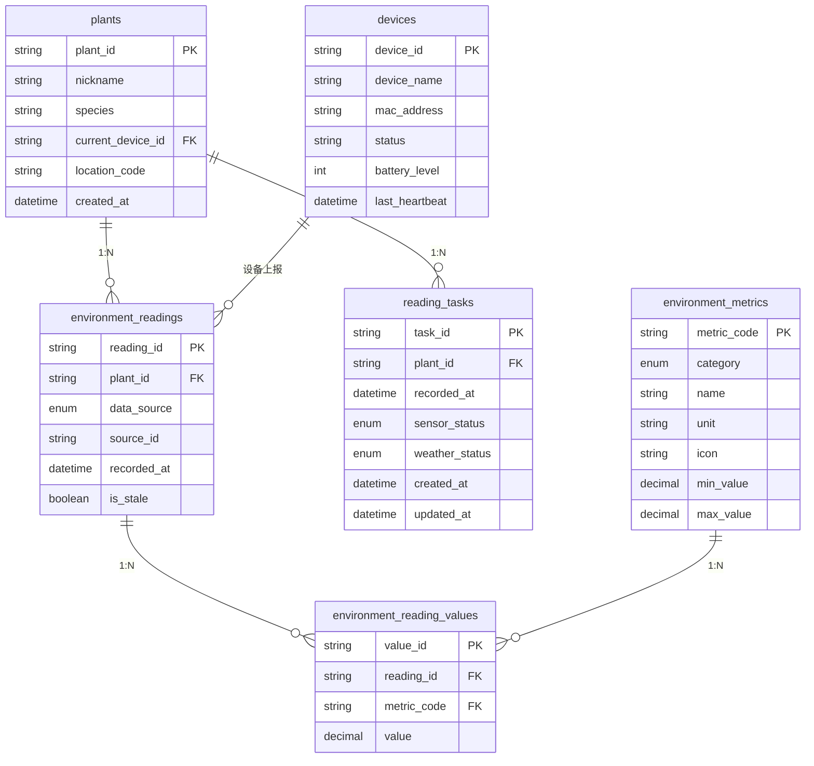
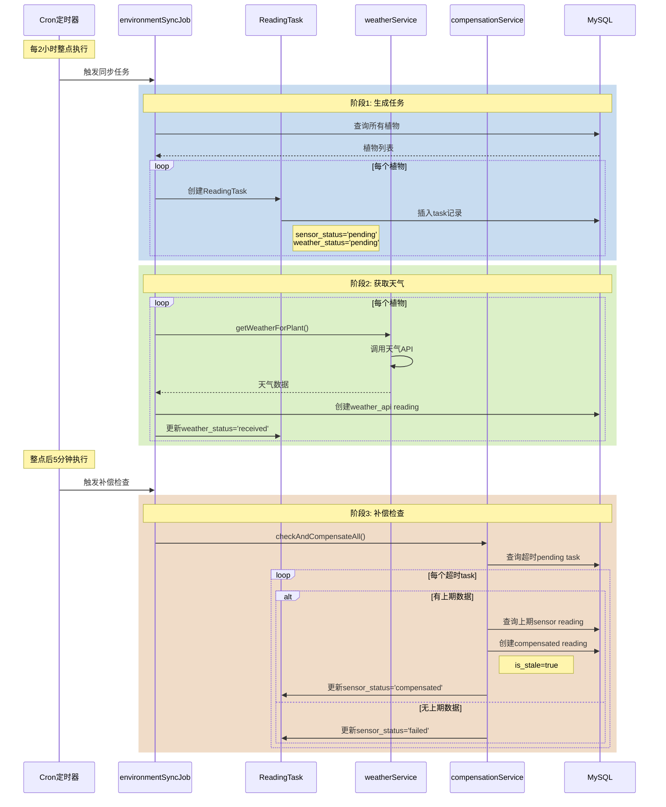
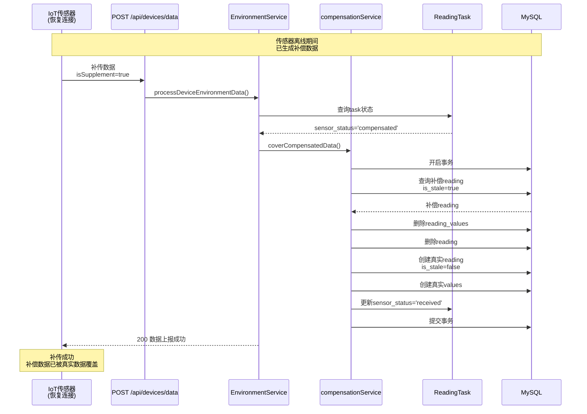
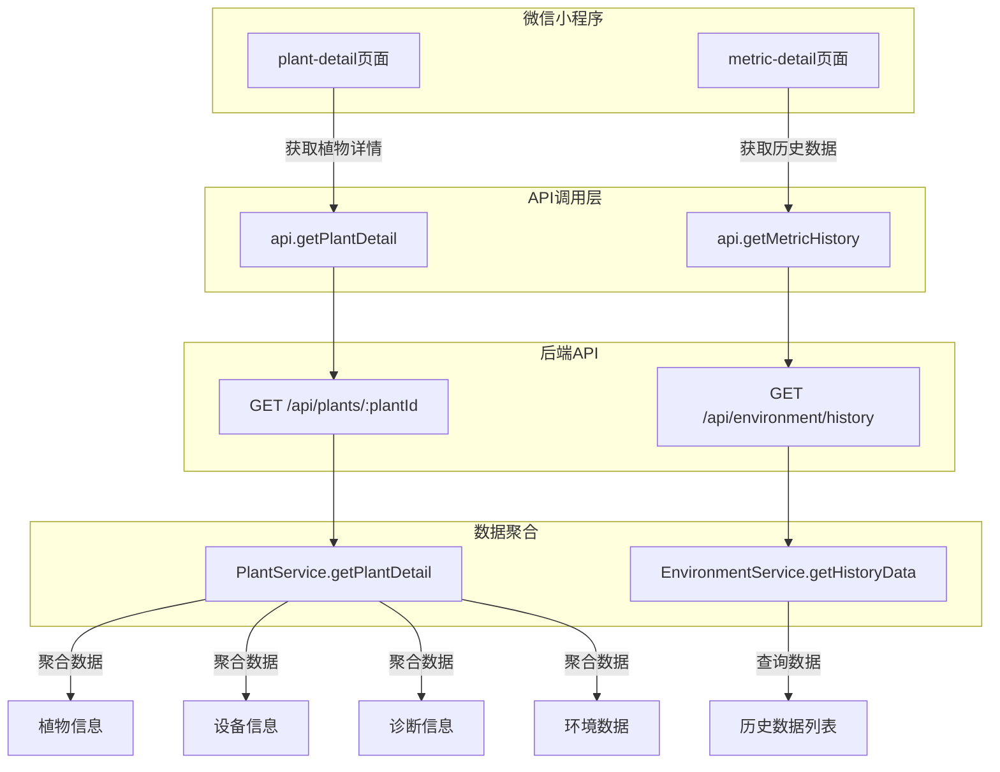
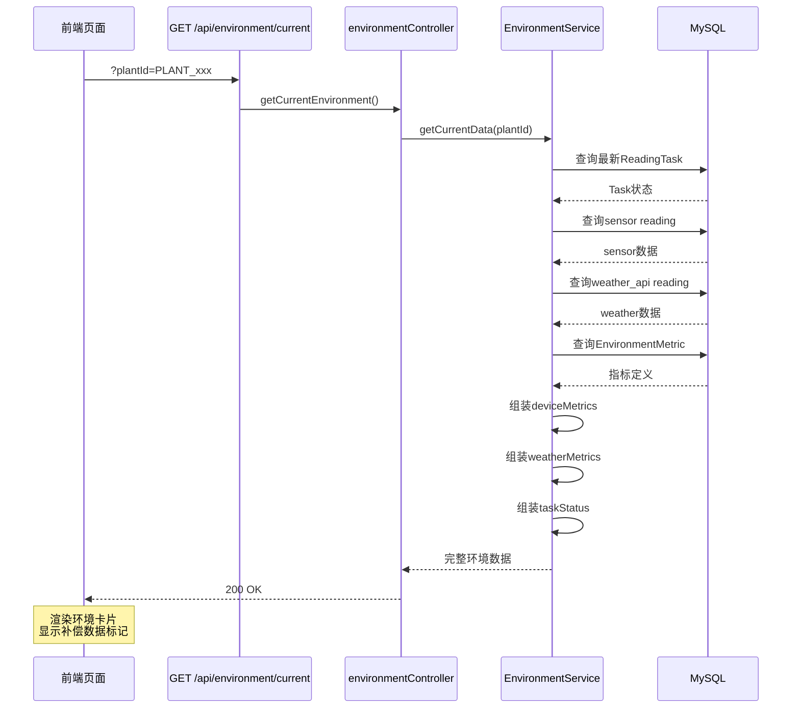
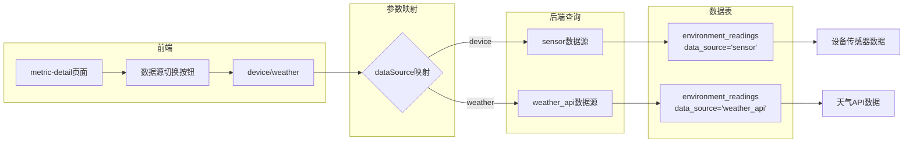
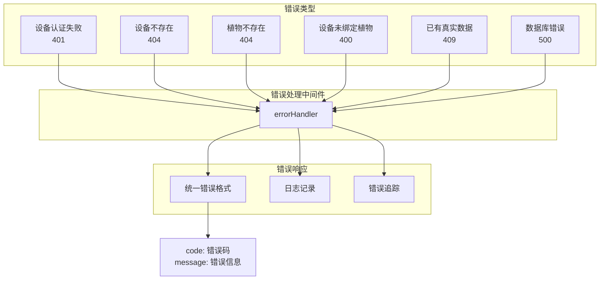

# 环境数据系统架构图

本文档包含环境数据系统的详细架构图，使用 Mermaid 语法绘制。

---

## 1. 系统整体架构



---

## 2. 数据上传流程架构



---

## 3. 服务层调用关系



---

## 4. 数据模型关系图



---

## 5. 定时任务执行流程



---

## 6. 补偿数据覆盖流程



---

## 7. 前端数据流架构



---

## 8. 环境数据查询架构



---

## 9. 数据源切换架构



---

## 10. 错误处理架构



---

## 架构设计原则

### 1. 分层架构

- **客户端层**：微信小程序、IoT设备
- **API网关层**：路由分发、认证授权
- **控制器层**：请求处理、参数验证
- **服务层**：业务逻辑、数据聚合
- **数据访问层**：ORM映射、数据库操作

### 2. 服务职责划分

| 服务 | 职责 | 依赖 |
|------|------|------|
| PlantService | 植物管理、数据聚合 | EnvironmentService |
| DeviceService | 设备管理、数据上报 | EnvironmentService |
| EnvironmentService | 环境数据处理、查询 | compensationService、weatherService |
| compensationService | 数据补偿、覆盖 | 无 |
| weatherService | 天气API调用 | 无 |

### 3. 数据流向

```
IoT设备 → DeviceService → EnvironmentService → compensationService → MySQL
定时任务 → EnvironmentService → weatherService → MySQL
前端页面 → API → Service → MySQL
```

### 4. 扩展性设计

- **服务解耦**：服务间单向依赖，无循环依赖
- **接口统一**：统一的API响应格式
- **错误处理**：统一的错误处理中间件
- **日志记录**：完整的日志记录体系
