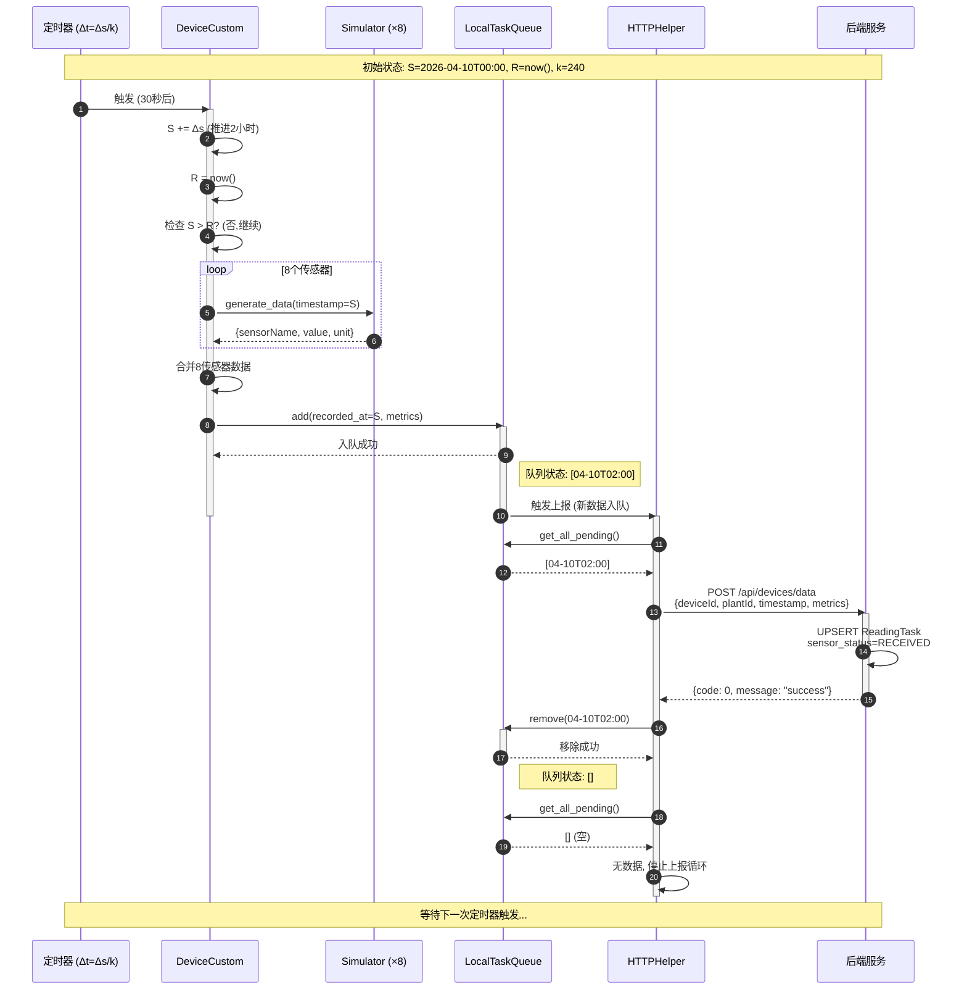
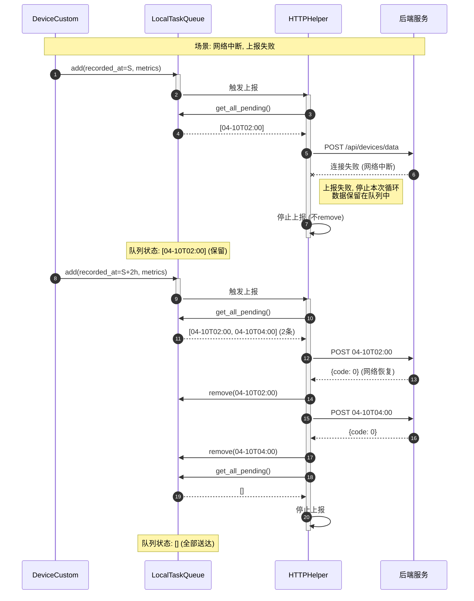
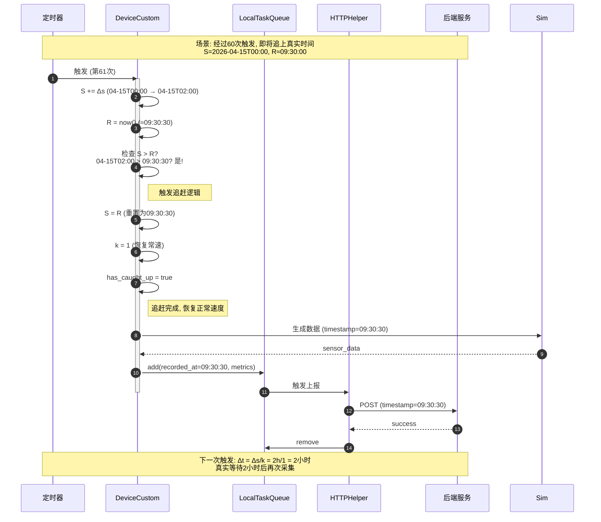
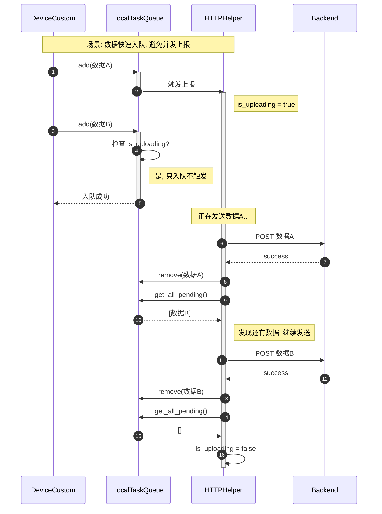
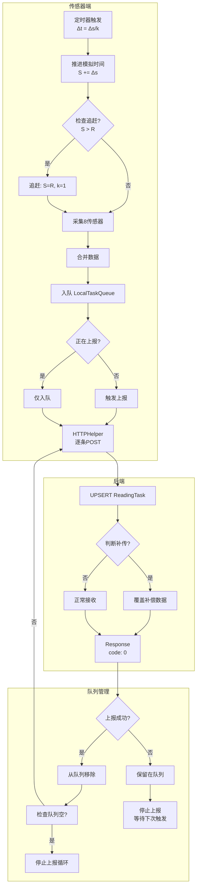

# 虚拟传感器系统时序图

## 1. 正常数据采集与上报时序

## 2. 网络失败与重试时序

## 3. 追赶逻辑时序

## 4. 并发控制时序（防止重复上报）

## 5. 完整数据流总结

## 关键设计点

| 设计点 | 说明 |
|:---|:---|
| **触发时机** | 新数据入队时触发上报（非定时） |
| **上报策略** | 逐条POST，成功移除，失败保留 |
| **并发控制** | 正在上报时，新数据只入队不触发新循环 |
| **追赶逻辑** | S > R 时，S=R, k=1，恢复常速 |
| **队列溢出** | FIFO，覆盖最老数据 |
