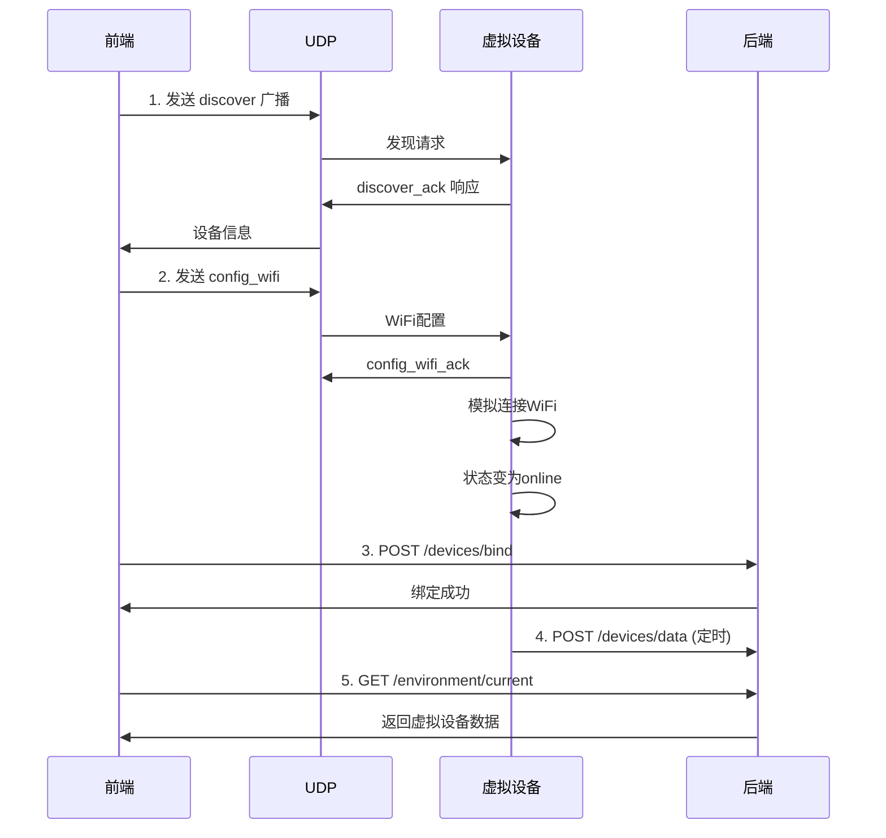

# 小程序前端与虚拟设备交互 - 工作区文档

**创建日期**: 2026-04-07  
**工作区路径**: `f:\PROJECTS\WeChatProjects\MVP\面向前端的设备页面与虚拟仿真设备对接实现工作小组`

---

## 文档清单

| 文档 | 文件名 | 说明 |
|------|--------|------|
| **评估报告** | [设备模块与虚拟设备测试工具评估报告.md](./设备模块与虚拟设备测试工具评估报告.md) | 现有代码的完整度和缺陷评估 |
| **规格文档** | [spec.md](./spec.md) | 详细的功能规格、通信协议、界面设计 |
| **任务分解** | [tasks.md](./tasks.md) | 11个具体任务的详细说明和依赖关系 |
| **检查清单** | [checklist.md](./checklist.md) | 开发和测试的完整检查项 |

---

## 快速导航

### 1. 了解现状
阅读 **[评估报告](./设备模块与虚拟设备测试工具评估报告.md)** 了解：
- 前端设备模块完整度：70%
- 后端设备模块完整度：75%
- 虚拟设备工具完整度：85%
- 主要对接问题和缺陷

### 2. 查看规格
阅读 **[spec.md](./spec.md)** 了解：
- 完整的交互流程（时序图）
- UDP 通信协议定义
- HTTP API 接口规范
- 界面设计原型
- 配置参数说明

### 3. 开始开发
阅读 **[tasks.md](./tasks.md)** 获取：
- 11个具体开发任务
- 任务优先级和依赖关系
- 预计工时评估
- 4阶段执行计划

### 4. 测试验证
使用 **[checklist.md](./checklist.md)** 进行：
- 开发前环境检查
- 开发中代码检查
- 集成测试验证
- 发布前最终检查

---

## 核心流程



---

## 关键任务（高优先级）

| 任务ID | 任务名称 | 模块 | 预计工时 |
|--------|---------|------|---------|
| VD-001 | 修改虚拟设备启动模式 | 虚拟设备 | 4h |
| VD-002 | 完善WiFi配置处理 | 虚拟设备 | 4h |
| VD-003 | 修复数据上报认证 | 虚拟设备 | 3h |
| BE-001 | 调整设备认证中间件 | 后端 | 2h |
| FE-001 | 优化前端UDP管理器 | 前端 | 4h |

---

## 文件路径速查

### 前端文件
```
frontend/pages/device-manage/device-manage.js
frontend/pages/device-manage/device-manage.wxml
frontend/pages/device-manage/device-manage.wxss
frontend/pages/device-detail/device-detail.js
frontend/utils/api.js
```

### 后端文件
```
backend/server/src/controllers/deviceController.js
backend/server/src/services/DeviceService.js
backend/server/src/models/Device.js
backend/server/src/middleware/deviceAuth.js
backend/server/src/routes/devices.js
```

### 虚拟设备文件
```
_dev/tools/python/virtual_device.py
_dev/tools/python/services/udp_service.py
_dev/tools/python/services/data_generator.py
_dev/tools/python/constants.py
_dev/tools/python/config.py
```

---

## 启动命令

### 启动后端
```bash
cd backend/server
npm run dev
```

### 启动虚拟设备（手动模式）
```bash
cd _dev/tools/python
python virtual_device.py --manual-mode --verbose
```

### 启动虚拟设备（带Web界面）
```bash
cd _dev/tools/python
python virtual_device.py --manual-mode --web
```

---

## 注意事项

1. **必须使用真机调试** - 小程序 UDP 不支持模拟器
2. **确保网络互通** - 手机和电脑需在同一 WiFi
3. **检查防火墙** - 确保 8266 端口未被阻止
4. **基础库版本** - 微信小程序基础库需 >= 2.10.0

---

## 问题反馈

在开发过程中遇到的问题，请记录在 [checklist.md](./checklist.md) 的"问题记录"章节。

---

*文档生成时间: 2026-04-07*
