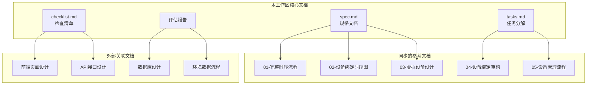

# 设备页面与虚拟设备相关文档清单

**管理范围**: 本工作区负责管理所有与设备页面和虚拟设备相关的文档  
**最后更新**: 2026-04-07

---

## 一、核心规格文档（本工作区创建）

| 序号 | 文档名称 | 文件名 | 说明 | 状态 |
|------|---------|--------|------|------|
| 1 | 设备模块与虚拟设备测试工具评估报告 | `设备模块与虚拟设备测试工具评估报告.md` | 现有代码评估分析 | ✅ 已完成 |
| 2 | 规格文档 | `spec.md` | 详细功能规格、通信协议、界面设计 | ✅ 已完成 |
| 3 | 任务分解 | `tasks.md` | 11个开发任务的详细说明 | ✅ 已完成 |
| 4 | 检查清单 | `checklist.md` | 开发和测试的完整检查项 | ✅ 已完成 |
| 5 | 工作区README | `README.md` | 文档索引和快速导航 | ✅ 已完成 |

---

## 二、从 docs/current 同步的参考文档

| 序号 | 文档名称 | 文件名 | 原始路径 | 说明 | 状态 |
|------|---------|--------|---------|------|------|
| 1 | 完整时序流程 | `01-完整时序流程-从进入设备界面到设备正常传数据.md` | `docs/current/02-architecture/diagrams/` | 从进入设备界面到数据上传的完整时序 | 📋 已同步 |
| 2 | 设备绑定时序图 | `02-设备绑定到数据上传完整时序图.md` | `docs/current/09-references/` | 设备绑定到数据上传的时序图 | 📋 已同步 |
| 3 | 虚拟设备模拟器设计 | `03-虚拟设备模拟器重写设计文档.md` | `docs/current/09-references/` | 虚拟设备模拟器的设计规格 | 📋 已同步 |
| 4 | 设备绑定逻辑重构 | `04-设备绑定逻辑重构方案.md` | `docs/current/09-references/` | 设备绑定逻辑的重构方案 | 📋 已同步 |
| 5 | 设备管理流程 | `05-设备管理流程.md` | `docs/current/05-process/` | 业务流程：设备管理 | 📋 已同步 |
| 6 | 虚拟设备模拟器设计（原始版） | `06-虚拟设备模拟器重写设计文档-原始版.md` | `_dev/tools/docs/` | 开发工具目录下的原始设计文档 | 📋 已同步 |

---

## 三、需要关注的其他相关文档（未同步，但需关注变更）

| 序号 | 文档名称 | 路径 | 说明 | 关注原因 |
|------|---------|------|------|---------|
| 1 | 前端页面设计 | `docs/current/03-frontend/前端页面设计.md` | 前端页面整体 design | 包含设备管理页设计 |
| 2 | API接口设计 | `docs/current/02-architecture/API接口设计.md` | 后端API接口规格 | 包含设备相关API |
| 3 | 数据库设计 | `docs/current/02-architecture/数据库设计.md` | 数据库表结构 | 包含Device表定义 |
| 4 | 环境数据流程 | `docs/current/05-process/04-环境数据流程.md` | 环境数据处理流程 | 设备数据上报流程 |
| 5 | 需求规格说明书 | `docs/current/01-product/需求规格说明书.md` | 产品需求规格 | 包含设备功能需求 |
| 6 | 系统架构设计 | `docs/current/02-architecture/系统架构设计.md` | 整体架构设计 | 设备模块架构 |

---

## 四、文档变更追踪

### 4.1 本工作区文档变更记录

| 日期 | 文档 | 变更类型 | 变更内容 | 变更人 |
|------|------|---------|---------|--------|
| 2026-04-07 | 评估报告 | 创建 | 初始版本创建 | AI Assistant |
| 2026-04-07 | spec.md | 创建 | 初始版本创建 | AI Assistant |
| 2026-04-07 | tasks.md | 创建 | 初始版本创建 | AI Assistant |
| 2026-04-07 | checklist.md | 创建 | 初始版本创建 | AI Assistant |
| 2026-04-07 | README.md | 创建 | 初始版本创建 | AI Assistant |

### 4.2 同步文档变更监控

| 文档 | 原始路径 | 最后同步时间 | 原始文档变更状态 | 需要同步 |
|------|---------|-------------|-----------------|---------|
| 完整时序流程 | `docs/current/02-architecture/diagrams/` | 2026-04-07 | 待监控 | 是 |
| 设备绑定时序图 | `docs/current/09-references/` | 2026-04-07 | 待监控 | 是 |
| 虚拟设备模拟器设计 | `docs/current/09-references/` | 2026-04-07 | 待监控 | 是 |
| 设备绑定逻辑重构 | `docs/current/09-references/` | 2026-04-07 | 待监控 | 是 |
| 设备管理流程 | `docs/current/05-process/` | 2026-04-07 | 待监控 | 是 |

---

## 五、文档债务追踪

### 5.1 已知文档债务

| 序号 | 问题描述 | 影响 | 优先级 | 计划解决时间 |
|------|---------|------|--------|-------------|
| 1 | 虚拟设备设计文档有两个版本（current 和 _dev/tools） | 可能内容不一致 | 中 | 需对比合并 |
| 2 | 设备绑定逻辑重构方案可能已过时 | 与当前代码不符 | 高 | 需验证更新 |
| 3 | 时序图文档分散在多个目录 | 查找困难 | 低 | 已在本工作区聚合 |

### 5.2 待办事项

- [ ] 对比 `03-虚拟设备模拟器重写设计文档.md` 和 `06-虚拟设备模拟器重写设计文档-原始版.md`，确认是否有差异
- [ ] 验证 `04-设备绑定逻辑重构方案.md` 是否与当前代码一致
- [ ] 更新 `05-设备管理流程.md` 以反映最新实现
- [ ] 创建虚拟设备使用手册（开发调试指南）

---

## 六、文档关联关系

---

## 七、文档维护责任

| 文档类型 | 维护责任 | 更新频率 |
|---------|---------|---------|
| 核心规格文档（spec/tasks/checklist） | 本工作区 | 随开发进度更新 |
| 同步的参考文档 | 原目录 + 本工作区 | 变更时同步 |
| 外部关联文档 | 原目录维护者 | 关注变更 |

---

## 八、快速访问

### 8.1 开发前必读
1. [spec.md](../spec.md) - 了解要实现什么
2. [tasks.md](../tasks.md) - 了解怎么分解任务
3. [01-完整时序流程](./01-完整时序流程-从进入设备界面到设备正常传数据.md) - 了解完整流程

### 8.2 开发中参考
1. [checklist.md](../checklist.md) - 检查开发进度
2. [03-虚拟设备模拟器设计](./03-虚拟设备模拟器重写设计文档.md) - 虚拟设备实现参考
3. [05-设备管理流程](./05-设备管理流程.md) - 业务流程参考

### 8.3 代码实现时参考
- 前端: `frontend/pages/device-manage/device-manage.js`
- 后端: `backend/server/src/controllers/deviceController.js`
- 虚拟设备: `_dev/tools/python/virtual_device.py`

---

*文档创建时间: 2026-04-07*  
*维护人: AI Assistant*
