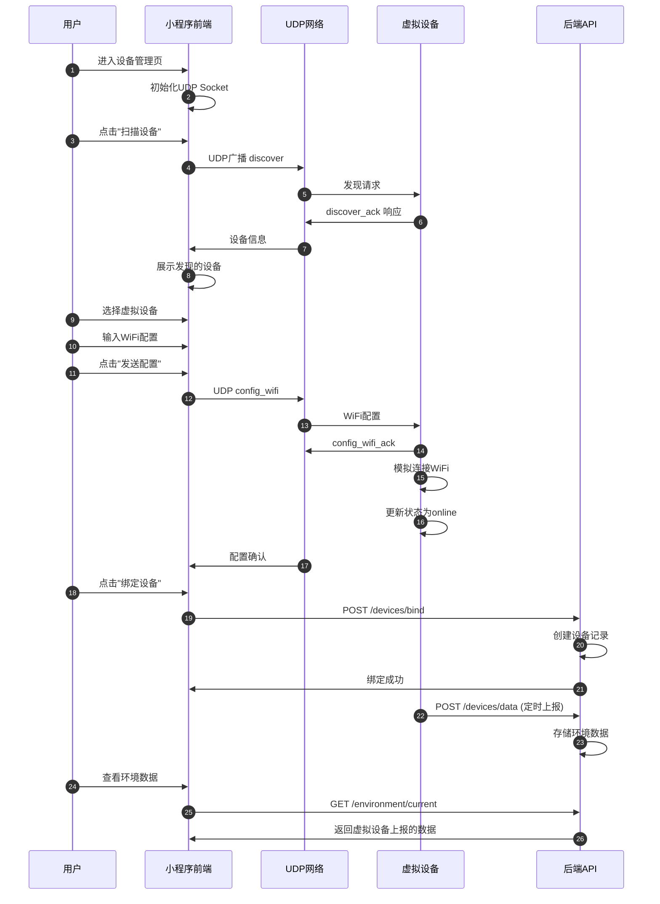
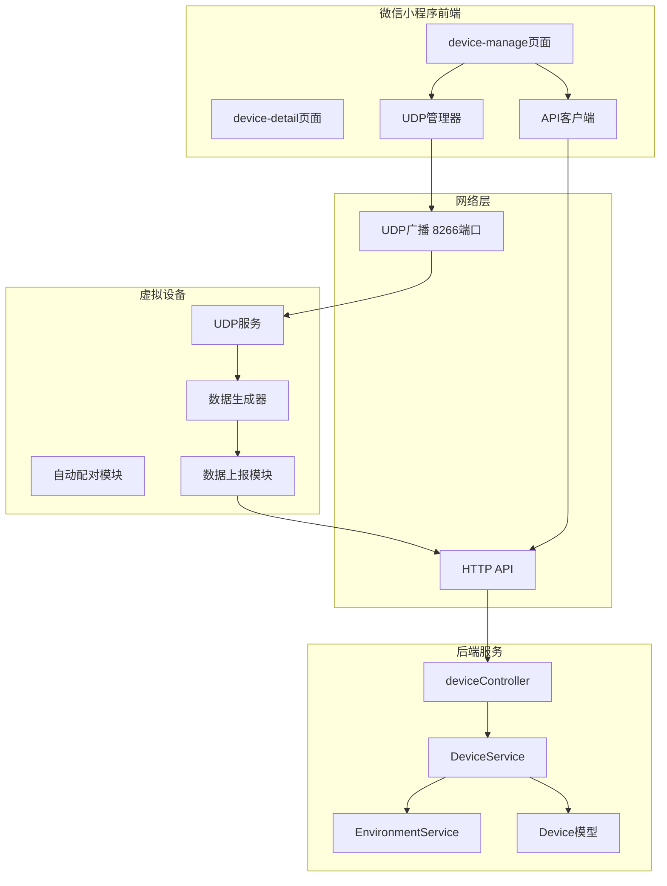

# 小程序前端与虚拟设备交互规格文档

**文档版本**: 1.0  
**创建日期**: 2026-04-07  
**文档状态**: 草稿  

---

## 1. 需求概述

### 1.1 目标
实现小程序前端与虚拟设备的完整交互流程，使虚拟设备如同真实设备一样可被探测、绑定、配置和数据交互。

### 1.2 用户场景
1. 开发人员在小程序前端扫描并发现虚拟设备
2. 通过UDP协议与虚拟设备通信（发现、配网）
3. 将虚拟设备绑定到植物档案
4. 虚拟设备自动上报环境数据到后端
5. 前端实时查看虚拟设备上报的数据

### 1.3 核心流程



---

## 2. 系统架构

### 2.1 架构图



### 2.2 模块职责

| 模块 | 职责 |
|------|------|
| **前端UDP管理器** | 管理UDP Socket生命周期，发送发现广播，接收设备响应 |
| **前端设备管理页** | 提供UI界面，协调UDP发现和HTTP绑定流程 |
| **虚拟设备UDP服务** | 监听UDP端口，响应发现请求和WiFi配置 |
| **虚拟设备数据生成器** | 按场景生成模拟传感器数据 |
| **虚拟设备上报模块** | 定时向后端上报环境数据 |
| **后端设备控制器** | 处理设备绑定、解绑、数据上报请求 |

---

## 3. 通信协议

### 3.1 UDP通信协议

#### 3.1.1 设备发现请求
```json
{
  "cmd": "discover",
  "app": "proj-alpha",
  "timestamp": 1712486400000
}
```

#### 3.1.2 设备发现响应
```json
{
  "cmd": "discover_ack",
  "macAddress": "VIRTUAL_12345678",
  "deviceName": "proj-alpha-虚拟设备-5678",
  "deviceType": "virtual_sensor",
  "ip": "192.168.1.100",
  "port": 8266,
  "rssi": -45,
  "firmwareVersion": "1.0.0",
  "status": "unbound",
  "timestamp": 1712486401000
}
```

#### 3.1.3 WiFi配置请求
```json
{
  "cmd": "config_wifi",
  "ssid": "MyHomeWiFi",
  "password": "password123",
  "timestamp": 1712486402000
}
```

#### 3.1.4 WiFi配置响应
```json
{
  "cmd": "config_wifi_ack",
  "status": "ok",
  "message": "配置已接收，正在连接...",
  "timestamp": 1712486403000
}
```

### 3.2 HTTP API协议

#### 3.2.1 设备绑定
```http
POST /api/devices/bind
Authorization: Bearer {token}
Content-Type: application/json

{
  "macAddress": "VIRTUAL_12345678",
  "deviceName": "proj-alpha-虚拟设备-5678",
  "plantId": "PLANT_xxx"
}
```

响应：
```json
{
  "code": 200,
  "message": "设备绑定成功",
  "data": {
    "deviceId": "DEVICE_xxx",
    "macAddress": "VIRTUAL_12345678",
    "deviceName": "proj-alpha-虚拟设备-5678",
    "status": "online"
  }
}
```

#### 3.2.2 设备数据上报
```http
POST /api/devices/data
Content-Type: application/json

{
  "deviceId": "DEVICE_xxx",
  "plantId": "PLANT_xxx",
  "timestamp": "2026-04-07T10:00:00Z",
  "metrics": {
    "temperature": 25.5,
    "humidity": 60.0,
    "soil_moisture": 45.0,
    "light_intensity": 15000,
    "battery_level": 85
  }
}
```

---

## 4. 功能规格

### 4.1 前端功能

#### 4.1.1 UDP设备发现
- **输入**: 用户点击"扫描设备"按钮
- **处理**:
  1. 检查WiFi连接状态
  2. 创建UDP Socket（如未创建）
  3. 发送discover广播到255.255.255.255:8266
  4. 监听响应5秒钟
  5. 收集所有响应的设备信息
- **输出**: 展示发现的设备列表

#### 4.1.2 设备选择
- **输入**: 用户点击设备列表中的某一项
- **处理**: 记录选中的设备MAC地址和设备信息
- **输出**: 高亮显示选中设备，展示WiFi配置表单

#### 4.1.3 WiFi配置发送
- **输入**: 用户输入WiFi SSID和密码，点击"发送配置"
- **处理**:
  1. 通过UDP向设备IP发送config_wifi消息
  2. 等待config_wifi_ack响应（超时10秒）
  3. 轮询等待设备状态变为online
- **输出**: 显示配置进度和结果

#### 4.1.4 设备绑定
- **输入**: 用户点击"绑定设备"
- **处理**:
  1. 调用POST /api/devices/bind
  2. 传递macAddress、deviceName、plantId
  3. 等待后端响应
- **输出**: 显示绑定成功/失败提示

### 4.2 虚拟设备功能

#### 4.2.1 UDP服务
- **监听端口**: 8266
- **支持命令**:
  - `discover`: 返回设备信息
  - `config_wifi`: 接收WiFi配置，返回确认

#### 4.2.2 WiFi配置处理
- **输入**: 收到config_wifi消息
- **处理**:
  1. 保存SSID和密码（模拟）
  2. 返回config_wifi_ack
  3. 延迟2秒后更新设备状态为online
  4. 立即上报一次数据

#### 4.2.3 数据上报
- **触发条件**:
  - 定时上报（默认60秒间隔）
  - WiFi配置完成后立即上报一次
- **数据内容**: 温度、湿度、土壤湿度、光照强度、电池电量等
- **上报目标**: POST /api/devices/data

### 4.3 后端功能

#### 4.3.1 设备绑定
- **输入**: macAddress、deviceName、plantId、userId
- **处理**:
  1. 根据MAC地址查找或创建设备
  2. 更新设备所属用户和名称
  3. 将设备绑定到指定植物
- **输出**: 设备信息

#### 4.3.2 数据上报处理
- **输入**: deviceId、plantId、timestamp、metrics
- **处理**:
  1. 验证设备是否存在
  2. 将数据存入environment_readings表
  3. 更新设备最后心跳时间
- **输出**: 上报结果

---

## 5. 状态定义

### 5.1 设备状态

| 状态 | 说明 | 转换条件 |
|------|------|---------|
| `unbound` | 未绑定 | 初始状态 |
| `online` | 在线 | 收到WiFi配置后或数据上报后 |
| `offline` | 离线 | 心跳超时（预留） |

### 5.2 配网流程状态

| 状态 | 说明 |
|------|------|
| `idle` | 空闲状态 |
| `scanning` | 正在扫描设备 |
| `selected` | 已选择设备 |
| `sending_config` | 正在发送WiFi配置 |
| `waiting_device` | 等待设备连接 |
| `done` | 配网完成 |
| `error` | 配网失败 |

---

## 6. 错误处理

### 6.1 前端错误

| 错误场景 | 处理方式 |
|---------|---------|
| UDP Socket创建失败 | 提示用户检查网络权限，提供降级方案 |
| 扫描超时无设备 | 提示确保设备已进入配网模式 |
| WiFi配置超时 | 提示检查设备是否在线，允许重试 |
| 绑定失败 | 显示错误信息，允许重新尝试 |

### 6.2 虚拟设备错误

| 错误场景 | 处理方式 |
|---------|---------|
| UDP端口被占用 | 自动尝试其他端口或提示用户 |
| 数据上报失败 | 记录日志，继续尝试下次上报 |
| 后端API不可用 | 记录错误，等待恢复后重试 |

### 6.3 后端错误

| 错误场景 | 处理方式 |
|---------|---------|
| 设备不存在 | 返回404错误码 |
| 参数缺失 | 返回400错误码和错误信息 |
| 数据库错误 | 返回500错误码，记录日志 |

---

## 7. 界面设计

### 7.1 设备管理页

```
┌─────────────────────────────────────┐
│ 📶 已连接: MyHomeWiFi               │
├─────────────────────────────────────┤
│ 绑定新设备                          │
│                                     │
│ 步骤1: 发现设备                     │
│ ┌───────────────────────────────┐   │
│ │ 📡 确保设备已进入配网模式      │   │
│ │                               │   │
│ │ [🔍 扫描设备]                 │   │
│ │ ████████░░░░░░░░░░ 50%        │   │
│ └───────────────────────────────┘   │
│                                     │
│ 发现的设备:                         │
│ ┌───────────────────────────────┐   │
│ │ 📡 proj-alpha-虚拟设备-5678  ✓ │   │
│ │    VIRTUAL_12345678            │   │
│ │    192.168.1.100:8266  -45dBm  │   │
│ └───────────────────────────────┘   │
│                                     │
│ 步骤2: 配置WiFi (选中设备后显示)    │
│ ┌───────────────────────────────┐   │
│ │ WiFi名称: [MyHomeWiFi    ]    │   │
│ │ WiFi密码: [********      ]    │   │
│ │                               │   │
│ │ 发送配置 → 设备连接 → 完成   │   │
│ │                               │   │
│ │ [🚀 发送配置]                 │   │
│ └───────────────────────────────┘   │
│                                     │
│ 步骤3: 绑定设备 (配置成功后显示)    │
│ ┌───────────────────────────────┐   │
│ │ 已选择: proj-alpha-虚拟设备    │   │
│ │                               │   │
│ │ [绑定到当前植物]              │   │
│ └───────────────────────────────┘   │
└─────────────────────────────────────┘
```

### 7.2 交互状态说明

| 状态 | UI表现 |
|------|-------|
| 扫描中 | 按钮禁用，显示进度条，显示"扫描中..." |
| 发现设备 | 设备列表展开，可点击选择 |
| 配置中 | 显示进度步骤条，按钮禁用 |
| 配置成功 | 显示绿色勾选，解锁绑定按钮 |
| 绑定成功 | Toast提示，返回上一页 |

---

## 8. 配置参数

### 8.1 前端配置

```javascript
// config.js
const DEVICE_CONFIG = {
  // UDP配置
  UDP_PORT: 8266,
  UDP_BROADCAST_ADDRESSES: ['255.255.255.255', '192.168.4.255', '192.168.1.255'],
  
  // 超时配置
  SCAN_TIMEOUT: 5000,        // 扫描超时 5秒
  CONFIG_TIMEOUT: 10000,     // 配置超时 10秒
  ONLINE_WAIT_TIMEOUT: 30000, // 等待上线 30秒
  
  // 重试配置
  CONFIG_RETRY_COUNT: 3,     // 配置重试次数
  
  // 发现设备过滤
  DEVICE_NAME_PREFIX: 'proj-alpha'  // 设备名称前缀过滤
}
```

### 8.2 虚拟设备配置

```python
# 虚拟设备启动参数
VIRTUAL_DEVICE_CONFIG = {
    'udp_port': 8266,           # UDP监听端口
    'server_url': 'http://localhost:3000',  # 后端地址
    'interval': 60,             # 数据上报间隔（秒）
    'scenario': 'normal',       # 默认场景
    'auto_pair': False,         # 禁用自动配对（由前端触发绑定）
}
```

---

## 9. 测试场景

### 9.1 正常流程测试

| 步骤 | 操作 | 预期结果 |
|------|------|---------|
| 1 | 启动虚拟设备 | 虚拟设备启动，UDP服务监听8266端口 |
| 2 | 进入设备管理页 | 页面加载，UDP Socket初始化 |
| 3 | 点击扫描设备 | 发现虚拟设备，显示在列表中 |
| 4 | 选择虚拟设备 | 设备高亮，显示WiFi配置表单 |
| 5 | 发送WiFi配置 | 虚拟设备响应，状态变为online |
| 6 | 绑定设备 | 绑定成功，设备出现在已绑定列表 |
| 7 | 查看环境数据 | 显示虚拟设备上报的数据 |

### 9.2 异常场景测试

| 场景 | 操作 | 预期结果 |
|------|------|---------|
| 设备未启动 | 扫描时虚拟设备未启动 | 显示"未发现设备" |
| 配置超时 | 虚拟设备不响应config_wifi | 显示"配置超时"，允许重试 |
| 绑定失败 | 后端服务不可用 | 显示错误信息，保留当前状态 |
| 网络切换 | 切换WiFi后扫描 | 提示检查WiFi连接 |

---

## 10. 依赖关系

### 10.1 前端依赖
- 微信小程序基础库 >= 2.10.0（支持UDP）
- 真机调试（小程序UDP不支持模拟器）

### 10.2 虚拟设备依赖
- Python >= 3.8
- 依赖包: requests, pyyaml

### 10.3 后端依赖
- Node.js >= 16
- 数据库连接正常

---

## 11. 附录

### 11.1 相关文档
- [设备模块与虚拟设备测试工具评估报告](./设备模块与虚拟设备测试工具评估报告.md)
- [虚拟设备模拟器重写设计文档](../_dev/tools/docs/虚拟设备模拟器重写设计文档.md)

### 11.2 相关文件
- 前端: `frontend/pages/device-manage/device-manage.js`
- 虚拟设备: `_dev/tools/python/virtual_device.py`
- 后端: `backend/server/src/controllers/deviceController.js`

---

*文档结束*
