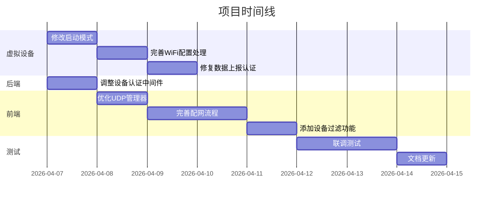
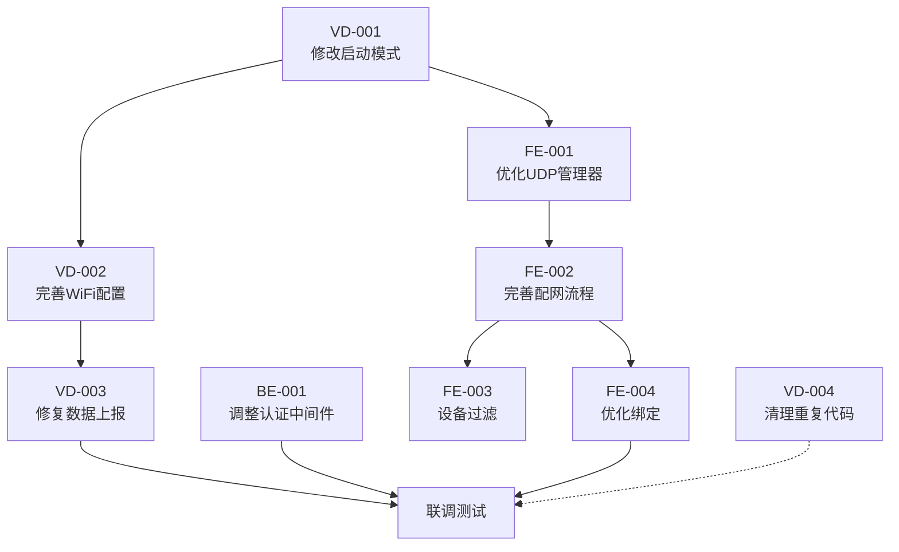

# 小程序前端与虚拟设备交互 - 任务分解

**文档版本**: 1.0  
**创建日期**: 2026-04-07  
**关联文档**: [spec.md](./spec.md)

---

## 任务总览

---

## 任务清单

### 🔴 优先级：高

#### 任务 1: 修改虚拟设备启动模式
- **ID**: VD-001
- **模块**: 虚拟设备
- **描述**: 修改虚拟设备，禁用自动配对模式，等待前端通过UDP发现并手动绑定
- **详细要求**:
  1. 添加 `--manual-mode` 启动参数
  2. 在手动模式下，跳过 `_guest_login`、`_create_plant`、`_bind_device` 流程
  3. 仅启动 UDP 服务，等待前端发现
  4. 生成随机的 MAC 地址和设备名称
- **输入文件**: `_dev/tools/python/virtual_device.py`
- **输出**: 虚拟设备以手动模式启动，可被前端发现
- **依赖**: 无
- **预计工时**: 4小时

#### 任务 2: 完善虚拟设备 WiFi 配置处理
- **ID**: VD-002
- **模块**: 虚拟设备
- **描述**: 完善 `_on_wifi_config` 回调，实现完整的配网模拟流程
- **详细要求**:
  1. 保存 WiFi 配置到状态
  2. 延迟 2 秒后更新设备状态为 `online`
  3. 更新 UDP 服务中的设备信息
  4. 触发一次立即数据上报
  5. 添加 `device_online` 通知消息（可选，用于前端轮询优化）
- **输入文件**: `_dev/tools/python/virtual_device.py`, `_dev/tools/python/services/udp_service.py`
- **输出**: 虚拟设备能正确响应 WiFi 配置并模拟上线
- **依赖**: VD-001
- **预计工时**: 4小时

#### 任务 3: 修复虚拟设备数据上报认证
- **ID**: VD-003
- **模块**: 虚拟设备
- **描述**: 修复数据上报时的认证问题，确保能正确通过后端 deviceAuth 验证
- **详细要求**:
  1. 检查 `report()` 方法中的 payload 格式
  2. 确保 deviceId 正确传递
  3. 如果后端需要 deviceKey，添加相应逻辑
  4. 测试数据上报是否成功
- **输入文件**: `_dev/tools/python/virtual_device.py`
- **输出**: 虚拟设备能成功上报数据到后端
- **依赖**: VD-002
- **预计工时**: 3小时

#### 任务 4: 调整后端设备认证中间件（开发环境）
- **ID**: BE-001
- **模块**: 后端
- **描述**: 调整 deviceAuth 中间件，在开发环境下允许虚拟设备的数据上报
- **详细方案**（二选一）:
  - **方案A**: 添加环境判断，开发环境跳过认证
  - **方案B**: 虚拟设备添加 deviceKey 支持
- **详细要求**:
  1. 如果选择方案A：检查 `NODE_ENV`，开发环境直接 `next()`
  2. 如果选择方案B：Device 模型添加 device_key 字段，验证时检查
  3. 更新虚拟设备，上报时携带 deviceKey
- **输入文件**: `backend/server/src/middleware/deviceAuth.js`, `backend/server/src/models/Device.js`
- **输出**: 虚拟设备数据上报能通过认证
- **依赖**: 无
- **预计工时**: 2小时

#### 任务 5: 优化前端 UDP 管理器
- **ID**: FE-001
- **模块**: 前端
- **描述**: 优化 UDP 管理器，增强稳定性和错误处理
- **详细要求**:
  1. 添加 Socket 状态管理（connecting, connected, error, closed）
  2. 添加自动重连机制
  3. 优化消息监听，避免重复绑定
  4. 添加更详细的日志输出
  5. 处理 UDP 权限被拒绝的情况
- **输入文件**: `frontend/pages/device-manage/device-manage.js`
- **输出**: 更稳定的 UDP 通信
- **依赖**: 无
- **预计工时**: 4小时

---

### 🟡 优先级：中

#### 任务 6: 完善前端配网流程
- **ID**: FE-002
- **模块**: 前端
- **描述**: 完善 `waitForDeviceOnline` 方法，实现真正的设备上线检测
- **详细要求**:
  1. 修改轮询逻辑，通过 UDP 发现检测设备状态变化
  2. 设备状态变为 `online` 后，自动进入绑定步骤
  3. 添加超时处理和重试机制
  4. 优化进度条显示，反映真实进度
- **输入文件**: `frontend/pages/device-manage/device-manage.js`
- **输出**: 配网流程闭环，用户可完成整个流程
- **依赖**: FE-001, VD-002
- **预计工时**: 6小时

#### 任务 7: 添加设备过滤功能
- **ID**: FE-003
- **模块**: 前端
- **描述**: 添加设备过滤，只显示 proj-alpha 相关的设备
- **详细要求**:
  1. 在 `handleDeviceResponse` 中添加过滤逻辑
  2. 只保留 `deviceName` 包含 "proj-alpha" 或 `deviceType` 为已知类型的设备
  3. 添加调试模式开关，可选显示所有设备
- **输入文件**: `frontend/pages/device-manage/device-manage.js`
- **输出**: 设备列表只显示有效设备
- **依赖**: FE-001
- **预计工时**: 2小时

#### 任务 8: 优化设备绑定流程
- **ID**: FE-004
- **模块**: 前端
- **描述**: 优化设备绑定，将 UDP 获取的设备信息同步到后端
- **详细要求**:
  1. 修改 `bindDevice` 方法，添加更多设备信息
  2. 传递 `ipAddress`、`firmwareVersion` 等字段（如果后端支持）
  3. 绑定成功后，更新本地设备状态
  4. 添加绑定失败的重试机制
- **输入文件**: `frontend/pages/device-manage/device-manage.js`
- **输出**: 绑定流程更完善
- **依赖**: FE-002
- **预计工时**: 3小时

#### 任务 9: 清理虚拟设备重复代码
- **ID**: VD-004
- **模块**: 虚拟设备
- **描述**: 清理 `data_generator.py` 中的重复方法定义
- **详细要求**:
  1. 删除重复的 `smooth_transition` 方法（第 110-140 行与第 140-167 行）
  2. 删除重复的 `get_current_values` 方法
  3. 删除重复的 `set_current_values` 方法
  4. 删除重复的 `reset_battery` 方法
- **输入文件**: `_dev/tools/python/services/data_generator.py`
- **输出**: 代码整洁，无重复
- **依赖**: 无
- **预计工时**: 1小时

---

### 🟢 优先级：低

#### 任务 10: 添加使用文档
- **ID**: DOC-001
- **模块**: 文档
- **描述**: 编写虚拟设备使用文档，说明如何与前端联调
- **详细要求**:
  1. 编写启动虚拟设备的步骤
  2. 说明前端操作流程
  3. 提供常见问题排查指南
  4. 添加调试技巧
- **输入**: 无
- **输出**: `README.md` 或 `USAGE.md`
- **依赖**: 所有开发任务完成
- **预计工时**: 3小时

#### 任务 11: 添加联调测试用例
- **ID**: TEST-001
- **模块**: 测试
- **描述**: 编写完整的联调测试用例
- **详细要求**:
  1. 正常流程测试（发现 → 配网 → 绑定 → 数据上报）
  2. 异常流程测试（超时、失败重试等）
  3. 边界条件测试（多设备、网络切换等）
- **输入**: 无
- **输出**: 测试用例文档
- **依赖**: 所有开发任务完成
- **预计工时**: 4小时

---

## 任务依赖图

---

## 执行计划

### 第一阶段：基础修复（第1-2天）
1. **VD-001**: 修改虚拟设备启动模式
2. **BE-001**: 调整后端设备认证中间件
3. **FE-001**: 优化前端 UDP 管理器
4. **VD-004**: 清理虚拟设备重复代码

### 第二阶段：流程完善（第3-4天）
5. **VD-002**: 完善虚拟设备 WiFi 配置处理
6. **FE-002**: 完善前端配网流程
7. **VD-003**: 修复虚拟设备数据上报认证

### 第三阶段：优化增强（第5天）
8. **FE-003**: 添加设备过滤功能
9. **FE-004**: 优化设备绑定流程

### 第四阶段：测试文档（第6-7天）
10. **TEST-001**: 联调测试
11. **DOC-001**: 添加使用文档

---

## 风险与应对

| 风险 | 影响 | 应对措施 |
|------|------|---------|
| 小程序UDP在模拟器不支持 | 高 | 必须使用真机调试，准备测试机 |
| 虚拟设备与前端网络不通 | 高 | 确保在同一局域网，检查防火墙设置 |
| 后端API变更 | 中 | 及时同步API文档，预留适配时间 |
| 进度延迟 | 中 | 优先完成高优先级任务，低优先级可延后 |

---

*文档结束*
