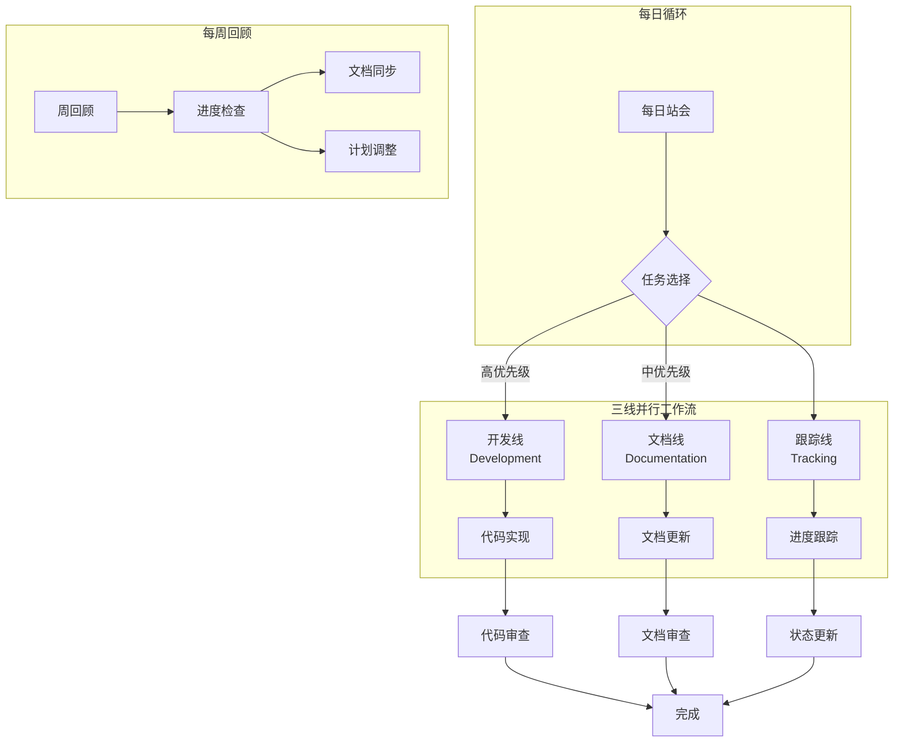

# 工作流规划：开发、文档更新与跟踪

**文档版本**: 1.0  
**创建日期**: 2026-04-07  
**目标**: 建立高效的三线并行工作流

---

## 一、工作流概览



---

## 二、三线工作流详解

### 2.1 开发线（Development）

#### 职责
- 实现 spec.md 中定义的功能
- 修复代码缺陷
- 编写和运行测试

#### 工作方式
```
1. 从 tasks.md 选择高优先级任务
2. 创建功能分支（如需要）
3. 编写代码实现
4. 本地测试验证
5. 更新任务状态
6. 提交代码
```

#### 每日输出
- 代码变更
- 测试报告
- 遇到的问题记录

---

### 2.2 文档线（Documentation）

#### 职责
- 同步更新技术文档
- 记录设计决策
- 更新使用说明

#### 工作方式
```
1. 开发完成后，检查是否需要文档更新
2. 更新相关文档
3. 检查文档间的一致性
4. 更新文档版本和日期
5. 在文档清单中标记状态
```

#### 文档更新触发条件
| 场景 | 需要更新的文档 |
|------|---------------|
| 修改虚拟设备代码 | `spec.md` 协议部分、虚拟设备使用手册 |
| 修改前端代码 | `spec.md` 界面部分、前端页面设计.md |
| 修改后端API | `spec.md` API部分、API接口设计.md |
| 修改流程逻辑 | `spec.md` 流程部分、设备管理流程.md |
| 发现新问题 | `checklist.md`、评估报告.md |

#### 每日输出
- 文档更新记录
- 文档债务清单更新

---

### 2.3 跟踪线（Tracking）

#### 职责
- 跟踪任务进度
- 监控文档状态
- 识别风险和阻塞

#### 工作方式
```
1. 每日检查任务完成状态
2. 更新 todo 列表
3. 检查文档同步状态
4. 识别阻塞问题
5. 调整优先级
```

#### 跟踪工具
- **tasks.md**: 任务完成情况
- **checklist.md**: 开发和测试检查项
- **docs/文档清单.md**: 文档状态追踪
- **todo 工具**: 实时任务状态

#### 每日输出
- 进度报告
- 风险预警
- 计划调整建议

---

## 三、每日工作流

### 3.1 每日启动（5分钟）

```markdown
## 每日启动检查清单

### 1. 查看昨日状态
- [ ] 查看昨日完成的任务
- [ ] 查看遗留问题
- [ ] 查看文档更新状态

### 2. 确定今日目标
- [ ] 选择 1-2 个高优先级开发任务
- [ ] 确定需要更新的文档
- [ ] 预估今日工作量

### 3. 检查阻塞
- [ ] 是否有阻塞的开发任务？
- [ ] 是否有需要澄清的需求？
- [ ] 是否有文档不一致？
```

### 3.2 工作时段分配

| 时间段 | 工作线 | 说明 |
|--------|--------|------|
| 上午 2h | 开发线 | 专注编码，实现核心功能 |
| 中午 30min | 文档线 | 同步更新上午开发的文档 |
| 下午 2h | 开发线 | 继续开发或修复问题 |
| 下午 30min | 跟踪线 | 更新进度，检查状态 |
| 傍晚 30min | 文档线 | 整理文档，更新清单 |

### 3.3 每日结束（10分钟）

```markdown
## 每日结束检查清单

### 1. 开发总结
- [ ] 今日完成了哪些任务？
- [ ] 代码是否已测试？
- [ ] 是否有遗留问题？

### 2. 文档总结
- [ ] 哪些文档已更新？
- [ ] 文档是否与代码一致？
- [ ] 是否有新的文档债务？

### 3. 明日计划
- [ ] 明日首要任务是什么？
- [ ] 是否有阻塞需要解决？
- [ ] 是否需要调整优先级？
```

---

## 四、每周工作流

### 4.1 周一：计划周

```markdown
## 周一计划

### 1. 回顾上周
- [ ] 检查上周任务完成情况
- [ ] 分析未完成原因
- [ ] 总结经验教训

### 2. 规划本周
- [ ] 确定本周核心目标
- [ ] 分解任务到每日
- [ ] 预留缓冲时间

### 3. 文档审查
- [ ] 检查文档一致性
- [ ] 识别需要重写的文档
- [ ] 更新文档债务清单
```

### 4.2 周三：中期检查

```markdown
## 周中检查

### 1. 进度检查
- [ ] 本周任务完成率？
- [ ] 是否按计划推进？
- [ ] 是否需要调整计划？

### 2. 质量检查
- [ ] 代码质量如何？
- [ ] 文档是否及时更新？
- [ ] 是否有技术债务积累？

### 3. 风险识别
- [ ] 是否有新的风险？
- [ ] 是否需要外部支持？
- [ ] 是否需要调整优先级？
```

### 4.3 周五：周总结

```markdown
## 周五总结

### 1. 成果总结
- [ ] 本周完成了哪些功能？
- [ ] 代码提交记录
- [ ] 文档更新记录

### 2. 问题总结
- [ ] 遇到了哪些问题？
- [ ] 如何解决的？
- [ ] 有哪些经验教训？

### 3. 下周准备
- [ ] 确定下周首要任务
- [ ] 清理本周遗留问题
- [ ] 更新所有文档状态
```

---

## 五、任务优先级管理

### 5.1 优先级定义

| 优先级 | 标识 | 说明 | 响应时间 |
|--------|------|------|---------|
| P0 - 紧急 | 🔴 | 阻塞开发的问题 | 立即处理 |
| P1 - 高 | 🟠 | 核心功能开发 | 本周完成 |
| P2 - 中 | 🟡 | 重要但非紧急 | 下周完成 |
| P3 - 低 | 🟢 | 优化改进 | 有空时处理 |

### 5.2 当前任务优先级（示例）

```markdown
## 当前任务优先级

### 🔴 P0 - 紧急（立即处理）
- [ ] 修复虚拟设备数据上报认证问题
- [ ] 调整后端 deviceAuth 中间件

### 🟠 P1 - 高（本周完成）
- [ ] 修改虚拟设备启动模式（手动模式）
- [ ] 完善虚拟设备 WiFi 配置处理
- [ ] 优化前端 UDP 管理器
- [ ] 完善前端配网流程

### 🟡 P2 - 中（下周完成）
- [ ] 添加设备过滤功能
- [ ] 优化设备绑定流程
- [ ] 清理虚拟设备重复代码

### 🟢 P3 - 低（有空时）
- [ ] 添加使用文档
- [ ] 添加联调测试用例
- [ ] 代码优化和重构
```

---

## 六、文档同步策略

### 6.1 同步触发时机

| 触发时机 | 同步动作 |
|---------|---------|
| 代码开发完成 | 更新 spec.md 相关章节 |
| 发现代码与文档不一致 | 立即更新文档 |
| 每日结束 | 检查并更新文档清单 |
| 每周结束 | 全面审查文档一致性 |

### 6.2 文档一致性检查清单

```markdown
## 文档一致性检查

### 代码 vs 文档
- [ ] 代码实现是否与 spec.md 一致？
- [ ] API 接口是否与 API接口设计.md 一致？
- [ ] 流程是否与 设备管理流程.md 一致？

### 文档 vs 文档
- [ ] spec.md 与 时序图 是否一致？
- [ ] 需求规格 与 实现 是否一致？
- [ ] 测试清单 与 代码 是否一致？

### 内部一致性
- [ ] 文档版本号是否更新？
- [ ] 文档日期是否更新？
- [ ] 交叉引用链接是否有效？
```

---

## 七、风险管理

### 7.1 风险识别与应对

| 风险 | 概率 | 影响 | 应对措施 |
|------|------|------|---------|
| 开发进度延迟 | 中 | 高 | 每日跟踪，及时调整优先级 |
| 文档与代码不同步 | 高 | 中 | 强制文档更新触发机制 |
| 需求变更 | 低 | 高 | 变更时同步更新所有文档 |
| 技术难点阻塞 | 中 | 高 | 及时升级，寻求帮助 |
| 文档债务积累 | 高 | 中 | 每周清理，避免堆积 |

### 7.2 升级机制

```
问题发现
    ↓
评估影响（高/中/低）
    ↓
高影响 → 立即处理（P0）
中影响 → 本周处理（P1）
低影响 → 排期处理（P2/P3）
    ↓
更新文档记录
    ↓
跟踪至解决
```

---

## 八、工具与模板

### 8.1 常用命令

```bash
# 快速启动虚拟设备（手动模式）
cd _dev/tools/python && python virtual_device.py --manual-mode --verbose

# 启动后端
cd backend/server && npm run dev

# 检查文档更新
git diff docs/

# 提交代码和文档
git add .
git commit -m "feat: xxx功能实现

docs: 更新xxx文档

- 功能说明
- 文档更新说明"
```

### 8.2 快速模板

#### 开发任务模板
```markdown
## 任务: [任务名称]

### 目标
[描述要实现什么]

### 实现步骤
1. [步骤1]
2. [步骤2]
3. [步骤3]

### 验收标准
- [ ] [标准1]
- [ ] [标准2]

### 相关文档
- [spec.md#章节](链接)
- [其他文档](链接)

### 预计工时
[X小时]
```

#### 文档更新模板
```markdown
## 文档更新: [文档名称]

### 更新原因
[为什么需要更新]

### 更新内容
- [内容1]
- [内容2]

### 关联代码
- [代码文件1]
- [代码文件2]

### 更新时间
[日期]
```

---

## 九、工作流检查清单

### 9.1 每日检查

- [ ] 开发任务按计划推进
- [ ] 文档及时同步更新
- [ ] 进度状态已更新
- [ ] 阻塞问题已识别
- [ ] 明日计划已确定

### 9.2 每周检查

- [ ] 周目标已完成
- [ ] 文档一致性已检查
- [ ] 文档债务已清理
- [ ] 下周计划已制定
- [ ] 风险已评估

### 9.3 每月检查

- [ ] 整体进度评估
- [ ] 文档质量评估
- [ ] 流程优化建议
- [ ] 技术债务清理

---

*文档创建时间: 2026-04-07*  
*维护人: AI Assistant*
