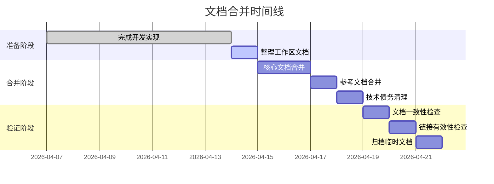

# 文档合并迁移计划

**计划版本**: 1.0  
**创建日期**: 2026-04-07  
**目标**: 明确工作区文档最终如何合并回 `docs/current` 文档树

---

## 一、合并原则

### 1.1 核心原则

```
┌─────────────────────────────────────────────────────────────┐
│                     文档合并原则                             │
├─────────────────────────────────────────────────────────────┤
│ 1. 不重复原则 - 相同内容只保留一份                           │
│ 2. 归位原则   - 文档应放入最合理的分类目录                     │
│ 3. 更新原则   - 合并时更新为最新、最准确的内容                 │
│ 4. 可追溯原则 - 保留变更历史，说明文档来源                     │
│ 5. 清理原则   - 合并后删除临时工作区文档，避免重复              │
└─────────────────────────────────────────────────────────────┘
```

### 1.2 文档分类策略

| 文档类型 | 目标位置 | 处理方式 |
|---------|---------|---------|
| 产品需求/规格 | `docs/current/01-product/` | 合并/更新 |
| 架构设计 | `docs/current/02-architecture/` | 合并/更新 |
| 前端设计 | `docs/current/03-frontend/` | 合并/更新 |
| 业务流程 | `docs/current/05-process/` | 合并/更新 |
| 测试相关 | `docs/current/06-testing/` | 新增/更新 |
| 开发工具文档 | `_dev/tools/docs/` | 更新 |
| 临时工作文档 | 工作区 | 合并后删除 |

---

## 二、最终返回文档清单

### 2.1 必须返回的核心文档

#### 2.1.1 产品需求层 (`docs/current/01-product/`)

| 工作区文档 | 目标位置 | 合并策略 | 说明 |
|-----------|---------|---------|------|
| `spec.md` | `01-product/设备与虚拟设备对接需求规格.md` | **新增** | 本次开发的核心规格文档 |

**合并要点**:
- 提取 spec.md 中的需求部分
- 与现有需求规格说明书整合
- 明确新增功能点和变更点

#### 2.1.2 架构设计层 (`docs/current/02-architecture/`)

| 工作区文档 | 目标位置 | 合并策略 | 说明 |
|-----------|---------|---------|------|
| `spec.md` 中的架构部分 | `02-architecture/系统架构设计.md` | **更新** | 更新架构图，添加虚拟设备交互 |
| `spec.md` 中的协议部分 | `02-architecture/API接口设计.md` | **更新** | 添加 UDP 协议规范 |
| `docs/01-完整时序流程-从进入设备界面到设备正常传数据.md` | `02-architecture/diagrams/完整时序流程：从进入设备界面到设备正常传数据.md` | **更新** | 替换为最新版本 |
| `docs/02-设备绑定到数据上传完整时序图.md` | `02-architecture/diagrams/设备绑定到数据上传完整时序图.md` | **更新** | 替换为最新版本 |

**合并要点**:
- 更新系统架构图，添加虚拟设备模块
- 在 API 接口设计中添加 UDP 通信协议章节
- 更新时序图，反映最新的交互流程

#### 2.1.3 前端设计层 (`docs/current/03-frontend/`)

| 工作区文档 | 目标位置 | 合并策略 | 说明 |
|-----------|---------|---------|------|
| `spec.md` 中的界面部分 | `03-frontend/前端页面设计.md` | **更新** | 更新设备管理页设计 |
| `spec.md` 中的配置部分 | `03-frontend/前端页面设计.md` | **更新** | 添加 UDP 配置说明 |

**合并要点**:
- 更新设备管理页的界面描述
- 添加 UDP 通信相关的配置说明
- 更新配网流程的交互说明

#### 2.1.4 业务流程层 (`docs/current/05-process/`)

| 工作区文档 | 目标位置 | 合并策略 | 说明 |
|-----------|---------|---------|------|
| `docs/05-设备管理流程.md` | `05-process/03-设备管理流程.md` | **更新** | 更新为最新流程 |
| `spec.md` 中的流程部分 | `05-process/03-设备管理流程.md` | **更新** | 整合虚拟设备交互流程 |

**合并要点**:
- 更新设备管理流程，添加虚拟设备场景
- 明确前端-虚拟设备-后端的完整流程

#### 2.1.5 测试相关 (`docs/current/06-testing/`)

| 工作区文档 | 目标位置 | 合并策略 | 说明 |
|-----------|---------|---------|------|
| `checklist.md` | `06-testing/设备与虚拟设备对接测试清单.md` | **新增** | 测试检查清单 |
| `tasks.md` 中的测试任务 | `06-testing/测试方案.md` | **更新** | 添加相关测试用例 |

**合并要点**:
- 新增设备与虚拟设备对接的测试清单
- 更新测试方案，添加 UDP 通信测试

#### 2.1.6 开发工具文档 (`_dev/tools/docs/`)

| 工作区文档 | 目标位置 | 合并策略 | 说明 |
|-----------|---------|---------|------|
| `docs/03-虚拟设备模拟器重写设计文档.md` | `_dev/tools/docs/虚拟设备模拟器重写设计文档.md` | **更新** | 替换为最新版本 |
| `spec.md` 中的虚拟设备配置 | `_dev/tools/docs/虚拟设备使用手册.md` | **新增** | 开发调试指南 |

**合并要点**:
- 更新虚拟设备设计文档
- 新增使用手册，方便开发人员使用

---

### 2.2 需要清理的临时文档

以下文档为工作区临时文档，合并后应删除：

| 文档 | 处理方式 | 说明 |
|------|---------|------|
| `设备模块与虚拟设备测试工具评估报告.md` | **归档后删除** | 评估报告已完成使命，内容已融入规格文档 |
| `tasks.md` | **内容分散合并后删除** | 任务已分解到各文档 |
| `checklist.md` | **合并到测试清单后删除** | 临时检查清单 |
| `docs/文档清单.md` | **合并到 README 后删除** | 临时追踪文档 |
| `docs/04-设备绑定逻辑重构方案.md` | **对比后删除/归档** | 如已过时则归档 |
| `docs/06-虚拟设备模拟器重写设计文档-原始版.md` | **对比后删除** | 临时备份 |

---

## 三、技术债务合并方案

### 3.1 已知技术债务清单

| 序号 | 债务描述 | 影响 | 合并时处理方案 |
|------|---------|------|---------------|
| 1 | 虚拟设备设计文档双版本 | 内容可能不一致 | 对比合并，保留最新版本 |
| 2 | 设备绑定逻辑重构方案可能过时 | 与代码不符 | 验证后更新或标记为已废弃 |
| 3 | 时序图分散在多个目录 | 查找困难 | 统一归位到 `02-architecture/diagrams/` |
| 4 | 设备管理流程未反映最新实现 | 流程不准确 | 更新为最新流程 |
| 5 | 缺少虚拟设备使用手册 | 开发调试困难 | 新增使用手册 |

### 3.2 债务合并详细方案

#### 债务 1: 虚拟设备设计文档双版本

```
当前状态:
├── docs/current/09-references/虚拟设备模拟器重写设计文档.md
└── _dev/tools/docs/虚拟设备模拟器重写设计文档.md

合并方案:
1. 对比两个版本的内容差异
2. 以 _dev/tools/docs/ 版本为基础（更贴近实现）
3. 合并 docs/current/09-references/ 版本中的架构说明
4. 更新到 _dev/tools/docs/ 目录
5. docs/current/09-references/ 中创建软链接或重定向说明
```

#### 债务 2: 设备绑定逻辑重构方案过时

```
当前状态:
└── docs/current/09-references/设备绑定逻辑重构方案.md

合并方案:
1. 对比方案与实际代码实现
2. 如已实现：更新方案状态为"已完成"，添加实现说明
3. 如部分实现：更新方案，标记已实现和待实现部分
4. 如未实现：评估是否仍需实现，如不需要则标记为"已废弃"
```

#### 债务 3: 时序图分散

```
当前状态:
├── docs/current/02-architecture/diagrams/完整时序流程：从进入设备界面到设备正常传数据.md
└── docs/current/09-references/设备绑定到数据上传完整时序图.md

合并方案:
1. 将 09-references/ 中的时序图移动到 02-architecture/diagrams/
2. 更新 09-references/README.md，添加重定向说明
3. 确保时序图内容最新，反映虚拟设备交互
```

#### 债务 4: 设备管理流程过时

```
当前状态:
└── docs/current/05-process/03-设备管理流程.md

合并方案:
1. 对比现有流程与本次开发的规格文档
2. 更新流程图，添加虚拟设备场景
3. 明确前端-虚拟设备-后端的交互步骤
4. 添加异常处理流程
```

#### 债务 5: 缺少虚拟设备使用手册

```
合并方案:
1. 基于 spec.md 中的配置部分
2. 添加启动命令和参数说明
3. 添加常见问题排查指南
4. 放置到 _dev/tools/docs/虚拟设备使用手册.md
```

---

## 四、合并执行计划

### 4.1 合并阶段



### 4.2 合并检查清单

#### 合并前检查
- [ ] 所有代码已实现并通过测试
- [ ] 工作区文档已更新为最终版本
- [ ] 已识别所有需要合并的文档
- [ ] 已制定合并策略

#### 合并中检查
- [ ] 每份文档合并后验证内容完整性
- [ ] 更新文档间的交叉引用链接
- [ ] 确保文档格式统一
- [ ] 更新文档版本和日期

#### 合并后检查
- [ ] 删除临时工作区文档
- [ ] 验证 docs/current 文档树完整性
- [ ] 检查是否有重复文档
- [ ] 更新 docs/current/README.md

---

## 五、合并后文档树结构

### 5.1 预期的 docs/current 结构

```
docs/current/
├── 01-product/
│   ├── README.md
│   ├── 需求规格说明书.md (更新，整合设备对接需求)
│   └── 设备与虚拟设备对接需求规格.md (新增，来自 spec.md)
├── 02-architecture/
│   ├── README.md
│   ├── 系统架构设计.md (更新，添加虚拟设备模块)
│   ├── API接口设计.md (更新，添加 UDP 协议)
│   ├── 数据库设计.md
│   └── diagrams/
│       ├── README.md
│       ├── 完整时序流程：从进入设备界面到设备正常传数据.md (更新)
│       └── 设备绑定到数据上传完整时序图.md (移动并更新)
├── 03-frontend/
│   ├── README.md
│   ├── 前端页面设计.md (更新，更新设备管理页)
│   └── ...
├── 05-process/
│   ├── README.md
│   ├── 03-设备管理流程.md (更新，添加虚拟设备场景)
│   └── ...
├── 06-testing/
│   ├── README.md
│   ├── 测试方案.md (更新，添加 UDP 测试)
│   └── 设备与虚拟设备对接测试清单.md (新增，来自 checklist.md)
└── 09-references/
    ├── README.md (更新，添加重定向说明)
    ├── 虚拟设备模拟器重写设计文档.md (软链接或重定向)
    └── 设备绑定逻辑重构方案.md (更新状态)

_dev/tools/docs/
├── 虚拟设备模拟器重写设计文档.md (更新)
└── 虚拟设备使用手册.md (新增)
```

---

## 六、风险与应对

| 风险 | 影响 | 应对措施 |
|------|------|---------|
| 文档合并过程中内容丢失 | 高 | 合并前备份，使用版本控制 |
| 文档链接失效 | 中 | 合并后统一检查链接 |
| 文档版本冲突 | 中 | 明确以工作区版本为准 |
| 合并后文档重复 | 中 | 合并后统一审查 |
| 临时文档未清理 | 低 | 使用检查清单确保清理 |

---

## 七、合并后清理清单

### 7.1 工作区清理

合并完成后，以下工作区内容应删除：

```
面向前端的设备页面与虚拟仿真设备对接实现工作小组/
├── 设备模块与虚拟设备测试工具评估报告.md  → 归档到 docs/archive/
├── tasks.md                                → 内容已分散合并
├── checklist.md                            → 已合并到测试清单
├── docs/
│   ├── 文档清单.md                          → 内容已融入 README
│   ├── 04-设备绑定逻辑重构方案.md            → 对比后删除/归档
│   └── 06-虚拟设备模拟器重写设计文档-原始版.md → 对比后删除
└── ... (保留 README.md 和 spec.md 作为入口，添加已合并说明)
```

### 7.2 最终保留的工作区内容

```
面向前端的设备页面与虚拟仿真设备对接实现工作小组/
├── README.md                    # 添加"已合并"说明，指向 docs/current
├── spec.md                      # 保留作为详细规格参考
└── docs/
    ├── 01-完整时序流程-从进入设备界面到设备正常传数据.md
    ├── 02-设备绑定到数据上传完整时序图.md
    ├── 03-虚拟设备模拟器重写设计文档.md
    └── 05-设备管理流程.md
```

> **注意**: 或者工作区可以完全删除，所有内容都已合并到 docs/current

---

*文档创建时间: 2026-04-07*  
*维护人: AI Assistant*
