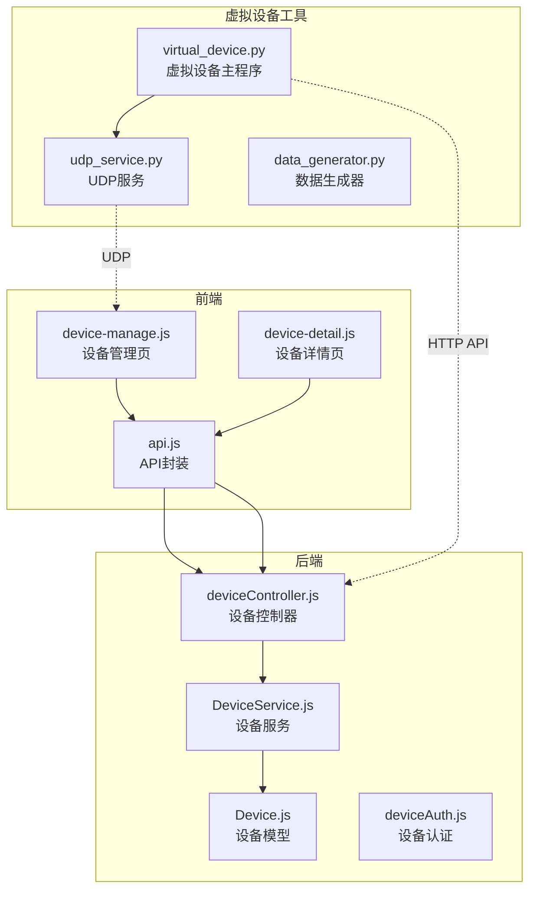
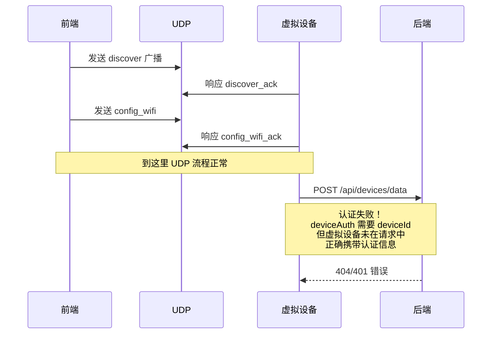

# 设备模块与虚拟设备测试工具评估报告

**评估日期**: 2026-04-07  
**评估范围**: 前端设备页面、后端设备模块、虚拟设备测试工具  
**评估目的**: 分析现有设备前端和后端业务逻辑与虚拟设备测试工具的对接能力，识别完整度和缺陷

---

## 一、模块架构概览

---

## 二、设备模块（前端+后端）完整度评估

### 2.1 功能完整度（70%）

| 功能模块 | 实现状态 | 说明 |
|---------|---------|------|
| **设备列表查询** | 完整 | 支持获取用户所有设备 |
| **设备绑定** | 完整 | 通过 MAC 地址绑定设备到植物 |
| **设备解绑** | 完整 | 解除设备与植物的绑定关系 |
| **设备详情** | 完整 | 展示设备基本信息和绑定植物 |
| **设备数据上报** | 完整 | 接收设备上报的环境数据 |
| **UDP 设备发现** | 部分 | 前端实现但依赖真实局域网环境 |
| **WiFi 配网** | 部分 | 前端实现但流程未闭环 |
| **设备状态管理** | 部分 | 缺少心跳检测机制 |
| **设备固件更新** | 缺失 | 无 OTA 升级功能 |

### 2.2 代码质量评估

**优点：**
- 前后端 API 接口设计规范，统一使用 `{ code, message, data }` 响应格式
- 前端 UDP 管理器封装良好，支持设备发现和 WiFi 配置
- 后端 Service 层逻辑清晰，使用 Sequelize 进行数据库操作
- 设备认证中间件提供了基础的安全验证

**缺陷：**

| 问题 | 严重程度 | 位置 | 说明 |
|------|---------|------|------|
| 设备状态更新依赖数据上报 | 高 | DeviceService | 没有独立的心跳检测，设备离线状态无法及时感知 |
| UDP 发现与后端未打通 | 高 | device-manage.js | 前端通过 UDP 发现的设备信息未同步到后端 |
| 配网流程未闭环 | 中 | device-manage.js | `waitForDeviceOnline` 方法逻辑不完整，无法真正检测设备上线 |
| 缺少设备密钥管理 | 中 | Device 模型 | 设备数据上报仅靠 deviceId 验证，安全性较低 |
| 设备网络信息未存储 | 中 | Device 模型 | IP 地址、SSID、信号强度等网络信息未持久化 |
| 前端状态管理较分散 | 低 | device-manage.js | 多个状态变量分散管理，可优化为统一状态机 |

---

## 三、虚拟设备测试工具完整度评估

### 3.1 功能完整度（85%）

| 功能模块 | 实现状态 | 说明 |
|---------|---------|------|
| **自动配对流程** | 完整 | 游客登录 → 创建植物 → 绑定设备 |
| **数据上报** | 完整 | 支持多种场景的数据模拟 |
| **UDP 服务** | 完整 | 支持设备发现和 WiFi 配置响应 |
| **场景模拟** | 完整 | 8 种场景（正常、干旱、高温等） |
| **状态持久化** | 完整 | 支持状态保存和恢复 |
| **Web 界面** | 完整 | 提供可视化控制界面 |
| **电池模拟** | 完整 | 支持电池电量递减模拟 |
| **数据平滑过渡** | 部分 | 场景切换时的平滑过渡有重复代码 |
| **设备心跳** | 缺失 | 没有独立的心跳上报机制 |

### 3.2 代码质量评估

**优点：**
- 架构设计良好，采用模块化设计（services/ 目录）
- 支持多种场景模式，数据生成逻辑丰富
- UDP 服务实现完整，能够响应前端的发现和配置请求
- 状态管理完善，支持断点续传
- 配置灵活，支持 YAML 配置文件

**缺陷：**

| 问题 | 严重程度 | 位置 | 说明 |
|------|---------|------|------|
| 数据上报未携带设备密钥 | 高 | virtual_device.py | 与后端的 deviceAuth 中间件对接存在问题 |
| 重复代码 | 中 | data_generator.py | `smooth_transition` 和 `get_current_values` 等方法重复定义 |
| 异常处理不够健壮 | 中 | virtual_device.py | 网络异常时重试机制不完善 |
| 日志输出混合 | 低 | 多处 | print 和 logger 混用 |
| 配置校验缺失 | 低 | config.py | 缺少配置参数的合法性校验 |

---

## 四、对接问题分析

### 4.1 主要对接障碍

### 4.2 具体问题清单

| 序号 | 问题描述 | 影响 | 解决方案 |
|------|---------|------|---------|
| 1 | **认证方式不匹配** | 虚拟设备无法上报数据 | 统一认证方式：方案 A：虚拟设备携带 deviceKey；方案 B：移除 deviceAuth 中间件（仅开发环境） |
| 2 | **配网流程未闭环** | 前端无法确认设备上线 | 虚拟设备在收到 WiFi 配置后，应主动上报一次数据或发送上线通知 |
| 3 | **设备发现信息未同步** | UDP 发现的设备与后端数据不一致 | 前端在绑定设备时，应将 UDP 获取的设备信息（IP、固件版本等）同步到后端 |
| 4 | **网络环境限制** | 小程序 UDP 需要真机调试 | 提供 Web 版虚拟设备调试工具，或完善使用文档 |
| 5 | **状态反馈延迟** | 设备状态更新不及时 | 后端增加设备心跳超时检测机制 |

---

## 五、改进建议

### 5.1 短期修复（1-2 天）

1. **修复虚拟设备认证问题**
   - 方案：在 `virtual_device.py` 的 `report()` 方法中，确保 deviceId 正确传递
   - 或临时移除 `deviceAuthMiddleware`（仅开发环境）

2. **修复重复代码**
   - 删除 `data_generator.py` 中重复的 `smooth_transition` 等方法（第 110-140 行与第 140-167 行重复）

3. **完善配网流程**
   - 虚拟设备在收到 WiFi 配置后，模拟连接过程并发送上线通知

### 5.2 中期优化（1 周）

1. **设备心跳机制**
   - 后端：增加独立的心跳检测接口 `/api/devices/heartbeat`
   - 虚拟设备：定时发送心跳包

2. **设备信息扩展**
   - Device 模型增加字段：`ip_address`, `ssid`, `firmware_version`, `signal_strength`

3. **前端状态优化**
   - 将 device-manage.js 中的分散状态整合为状态机

### 5.3 长期规划（1 月）

1. **设备安全增强**
   - 增加设备密钥机制，每个设备生成唯一的 deviceKey
   - 数据上报时校验 deviceKey

2. **OTA 升级支持**
   - 增加固件版本管理和升级功能

3. **Web 版调试工具**
   - 开发基于 Web 的虚拟设备调试界面，降低调试门槛

---

## 六、总结

| 模块 | 完整度 | 主要缺陷 | 优先级 |
|------|-------|---------|-------|
| **前端设备模块** | 70% | UDP 与后端未打通、配网流程未闭环 | 中 |
| **后端设备模块** | 75% | 缺少心跳机制、设备信息字段不足 | 中 |
| **虚拟设备工具** | 85% | 认证对接问题、代码重复 | 高 |

**核心问题**：虚拟设备与后端的认证对接存在障碍，导致数据上报失败。这是当前阻碍两个模块对接的最主要问题，建议优先修复。

---

## 七、相关文件路径

### 前端文件
- `frontend/pages/device-manage/device-manage.js` - 设备管理页逻辑
- `frontend/pages/device-manage/device-manage.wxml` - 设备管理页结构
- `frontend/pages/device-manage/device-manage.wxss` - 设备管理页样式
- `frontend/pages/device-detail/device-detail.js` - 设备详情页逻辑
- `frontend/utils/api.js` - API 封装

### 后端文件
- `backend/server/src/controllers/deviceController.js` - 设备控制器
- `backend/server/src/services/DeviceService.js` - 设备服务
- `backend/server/src/models/Device.js` - 设备模型
- `backend/server/src/routes/devices.js` - 设备路由
- `backend/server/src/middleware/deviceAuth.js` - 设备认证中间件

### 虚拟设备工具文件
- `_dev/tools/python/virtual_device.py` - 虚拟设备主程序
- `_dev/tools/python/services/udp_service.py` - UDP 服务
- `_dev/tools/python/services/data_generator.py` - 数据生成器
- `_dev/tools/python/constants.py` - 常量定义
- `_dev/tools/python/config.py` - 配置管理

---

*报告生成时间: 2026-04-07*  
*评估人: AI Assistant*
